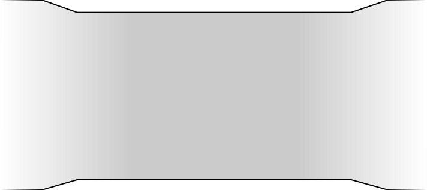
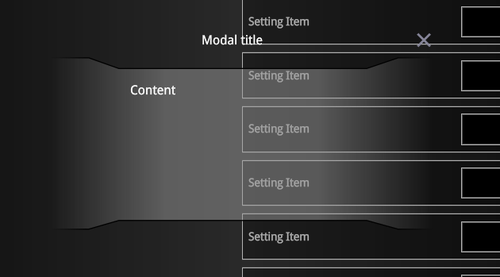
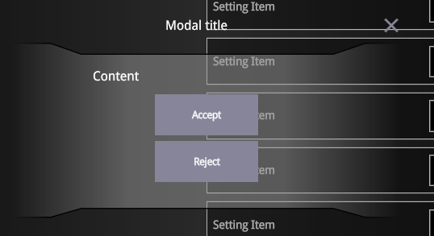

The `Modal` component is a flexible and customizable dialog used to display content over the main UI of your application.

To provide greater control, `Modal` supports multiple slots, allowing you to override the default overlay and modal window structure with your own content and styles.

## Usage

Using the `Modal` component is simple. You can import it and incorporate it into your app as shown below:

```tsx
import Modal from '@components/Basic/Modal/Modal';
import ModalCloseIcon from '@components/Basic/Modal/ModalCloseIcon.svg?component-solid';
import Block from '@components/Layout/Block/Block';
import Flex from '@components/Layout/Flex/Flex';
import Top from '@components/Layout/Top/Top';
import Content from '@components/Layout/Content/Content';
import Bottom from '@components/Layout/Bottom/Bottom';
import Button from '@components/Basic/Button/Button';

const App = () => {
    return (
        <Modal open>
            <Modal.Overlay style={{ background: 'rgba(0, 0, 0, 0.5)' }} />
            <Modal.Window>
                <Top>
                    <Flex justify-content='space-between' align-items='center'>
                        <Block>Modal title</Block>
                        <Modal.Close style={{ width: '2vmax', height: '2vmax' }}>
                            <ModalCloseIcon />
                        </Modal.Close>
                    </Flex>
                </Top>
                <Content>
                    Content
                </Content>
                <Bottom>
                    <Flex justify-content='end'>
                        <Modal.Close style={{ "margin-right": '0.5vmax' }}>
                            <Button size='small' textFit={false}>Accept</Button>
                        </Modal.Close>
                        <Modal.Close>
                            <Button size='small' textFit={false}>Reject</Button>
                        </Modal.Close>
                    </Flex>
                </Bottom>
            </Modal.Window>
        </Modal>
    );
};

export default App;
```

## API

### Props

| Prop    | Type                    | Default     | Description                                                                                                  |
| ------- | ----------------------- | ----------- | ------------------------------------------------------------------------------------------------------------ |
| `style` | `JSX.CSSProperties`     | `{}`        | Inline styles applied to the modal's root element.                                                           |
| `class` | `string`                | `""`        | Additional CSS classes to customize the modal's appearance.                                                  |
| `ref`   | `ModalRef \| undefined` | `undefined` | Reference to the modal instance. You can use it to call methods like `open()` or `close()` programmatically. |
| `open`  | `boolean`               | `false`     | Determines whether the modal is initially visible.                                                           |
| `onOpen`  | `() => void`               | `undefined`     | Callback invoked when the modal is opened.                                                           |
| `onClose` | `() => void`               | `undefined`     | Callback invoked when the modal is closed.                                                           |


### Methods

| Method     | Parameters | Returns   | Description                                                                |
| ---------- | ---------- | --------- | -------------------------------------------------------------------------- |
| `open()`   | -          | `void`    | Opens the modal programmatically.                                          |
| `close()`  | -          | `void`    | Closes the modal programmatically.                                         |
| `isOpen()` | -          | `boolean` | Returns `true` if the modal is currently open; otherwise, returns `false`. |

## Slots

### `Modal.Overlay`

This slot lets you define the modal's background overlay. Use it to enable or customize the overlay that appears behind the modal window.

:::note
The `Modal` component does not include an overlay by default. To enable it, you must explicitly add the `Modal.Overlay` slot.
:::

#### Properties

| Prop Name | Type                | Default | Description                                            |
| --------- | ------------------- | ------- | ------------------------------------------------------ |
| `style`   | `JSX.CSSProperties` | `{}`    | Inline styles applied directly to the overlay element. |
| `class`   | `string`            | `""`    | CSS classes for additional overlay styling.            |

#### Usage

```tsx
import Modal from '@components/Basic/Modal/Modal';

const App = () => {
    return (
        <Modal open>
            <Modal.Overlay style={{ background: 'rgba(0, 0, 0, 0.5)' }} />
        </Modal>
    );
};

export default App;
```

### `Modal.Window`

Use this slot to define and customize the modal window itself. This is where you place your dialog content.

#### Properties

| Prop Name | Type                | Default | Description                                |
| --------- | ------------------- | ------- | ------------------------------------------ |
| `style`   | `JSX.CSSProperties` | `{}`    | Inline styles for the modal window.        |
| `class`   | `string`            | `""`    | Additional CSS classes for custom styling. |
| `children`   | `JSX.Element` | `""` | Content to be displayed inside the window. |

#### Usage

```tsx
import Modal from '@components/Basic/Modal/Modal';

const App = () => {
    return (
        <Modal open>
            <Modal.Window style={{ background: 'red' }}>
                Content and structure of the modal dialog goes here.
            </Modal.Window>
        </Modal>
    );
};

export default App;
```

### `Modal.Close`

The `Modal.Close` slot is used to wrap any element that should trigger the closing of the modal when clicked. This is typically a button or an icon, but it can be any clickable element. The slot can be placed anywhere inside the modal window and used multiple times if needed.

#### Properties

| Prop Name  | Type                | Default | Description                                                                 |
| ---------- | ------------------- | ------- | --------------------------------------------------------------------------- |
| `style`    | `JSX.CSSProperties` | `{}`    | Inline styles for the close button.                                         |
| `class`    | `string`            | `""`    | Additional CSS classes for styling the close button.                        |
| `children` | `JSX.Element`       | `""`    | Content rendered inside the button (e.g., text, icon, or custom component). |

#### Usage

```tsx
import Modal from '@components/Basic/Modal/Modal';
import Button from '@components/Basic/Button/Button';

const App = () => {
    return (
        <Modal open>
            <Modal.Window style={{ background: 'red' }}>
                <Modal.Close>
                    <Button size='small' textFit={false}>Close</Button>
                </Modal.Close>
            </Modal.Window>
        </Modal>
    );
};

export default App;
```

## Guide

### Customizing the Modal Window

By default, the `Modal.Window` slot provides a basic layout - a white background with no predefined content. This minimalist setup allows you to fully customize the modal window according to your needs. You can insert any content within `Modal.Window`, including text, buttons, or other components.

To help structure the modal's layout, you can use the `Top`, `Content`, and `Bottom` components. These subcomponents make it easier to build consistent and flexible modal designs by organizing the content into clear sections.

Refer to the [first example](#usage) on this page for a demonstration of how to use these components.

### Creating a Modal with a Background Behind the Content

To add a background specifically behind the content of a modal, you can again use the `Top`, `Content`, and `Bottom` components for structure. Use `Top` for titles or headers and `Content` for the main area of the modal.

To customize the content background, apply a background image or color to the `Content` component. Then, remove the `Modal.Window` background by setting its style to none.

```tsx
import Modal from '@components/Basic/Modal/Modal';
import Button from '@components/Basic/Button/Button';
import Modal from '@components/Basic/Modal/Modal';
import ModalCloseIcon from '@components/Basic/Modal/ModalCloseIcon.svg?component-solid';
import Block from '@components/Layout/Block/Block';
import Flex from '@components/Layout/Flex/Flex';
import Top from '@components/Layout/Top/Top';
import Content from '@components/Layout/Content/Content';
import Bottom from '@components/Layout/Bottom/Bottom';
import Button from '@components/Basic/Button/Button';

const App = () => {
    return (
        <Modal open>
            <Modal.Overlay />
            <Modal.Window style={{ background: 'none' }}>
                <Top>
                    <Flex align-items='center'>
                        <Block style={{ color: 'white', "text-align": 'center', flex: '1 0 0' }}>Modal title</Block>
                        <Modal.Close style={{ width: '2vmax', height: '2vmax' }}>
                            <ModalCloseIcon />
                        </Modal.Close>
                    </Flex>
                </Top>
                <Content
                    style={{
                        color: 'white',
                        background: 'url(./content-bg.svg)',
                        height: '17vmax',
                        padding: '2.5vmax 8vmax',
                        'background-repeat': 'no-repeat',
                        'background-size': '100% 100%',
                    }}
                >
                    Content
                </Content>
            </Modal.Window>
        </Modal>
    );
};

export default App;
```

In this example, the background of the Content section is set to an image: `./content-bg.svg`:



The result will appear as follows:



### Adding Controls Inside the Modal Content

You can enhance the previous example by adding close buttons directly within the modal's content. Since the `Modal.Close` slot can be used multiple times, it's perfectly fine to place close buttons inside the `Content` area.

```diff lang="tsx"
import Modal from '@components/Basic/Modal/Modal';
import Button from '@components/Basic/Button/Button';
import ModalCloseIcon from '@components/Basic/Modal/ModalCloseIcon.svg?component-solid';
import Block from '@components/Layout/Block/Block';
import Flex from '@components/Layout/Flex/Flex';
import Top from '@components/Layout/Top/Top';
import Content from '@components/Layout/Content/Content';
import Bottom from '@components/Layout/Bottom/Bottom';
import Button from '@components/Basic/Button/Button';

const App = () => {
    return (
        <Modal open>
            <Modal.Overlay />
            <Modal.Window style={{ background: 'none' }}>
                <Top>
                    <Flex align-items='center'>
                        <Block style={{ color: 'white', "text-align": 'center', flex: '1 0 0' }}>Modal title</Block>
                        <Modal.Close style={{ width: '2vmax', height: '2vmax' }}>
                            <ModalCloseIcon />
                        </Modal.Close>
                    </Flex>
                </Top>
                <Content
                    style={{
                        color: 'white',
                        background: 'url(./content-bg.svg)',
                        height: '17vmax',
                        padding: '2.5vmax 8vmax',
                        'background-repeat': 'no-repeat',
                        'background-size': '100% 100%',
                    }}
                >
                    Content
                    <Flex direction='column'>
                        Content
+                        <Flex align-items='center' direction='column' style={{ "margin-top": '1vmax' }}>
+                            <Modal.Close style={{ "margin-bottom": '0.5vmax' }}>
+                                <Button size='small' textFit={false}>Accept</Button>
+                            </Modal.Close>
+                            <Modal.Close>
+                                <Button size='small' textFit={false}>Reject</Button>
+                            </Modal.Close>
+                        </Flex>
                    </Flex>
                </Content>
            </Modal.Window>
        </Modal>
    );
};

export default App;
```

You can also attach click handlers to the `Accept` and `Reject` buttons to trigger specific actions when modal closes:

```tsx
<Button click={() => console.log('Accepted')} size='small' textFit={false}>Accept</Button>
```

The end result will look like this:



### Opening and Closing the Modal Programmatically

The `Modal` component also allows you to control its state through code.

#### Steps

1. Create a ref of type `ModalRef` and bind it to the `Modal` component.
2. Use `ref.open()` and `ref.close()` methods to toggle the modal programmatically (e.g., via keyboard or external UI control).

```tsx
import Modal, { ModalRef } from '@components/Basic/Modal/Modal';
import ModalCloseIcon from '@components/Basic/Modal/ModalCloseIcon.svg?component-solid';
import Block from '@components/Layout/Block/Block';
import Flex from '@components/Layout/Flex/Flex';
import Top from '@components/Layout/Top/Top';
import Content from '@components/Layout/Content/Content';
import Bottom from '@components/Layout/Bottom/Bottom';
import Button from '@components/Basic/Button/Button';
import { onMount } from 'solid-js';

const App = () => {
    let ref!: ModalRef;

    const handleKeyDown = (e: KeyboardEvent) => {
        if (e.keyCode === 13 && ref.isOpen()) {
            ref.close();
        }
    };

    onMount(() => {
        window.addEventListener('keydown', handleKeyDown);
        return () => window.removeEventListener('keydown', handleKeyDown);
    });

    return (
        <>
            <Button click={() => ref.open()} size='small' textFit={false}>Open modal</Button>
            <Modal ref={ref}>
                <Modal.Overlay style={{ background: 'rgba(0, 0, 0, 0.5)' }} />
                <Modal.Window>
                    <Top>
                        <Flex justify-content='space-between' align-items='center'>
                            <Block>Modal title</Block>
                            <Modal.Close style={{ width: '2vmax', height: '2vmax' }}>
                                <ModalCloseIcon />
                            </Modal.Close>
                        </Flex>
                    </Top>
                    <Content>
                        Content
                    </Content>
                    <Bottom>
                        <Flex justify-content='end'>
                            <Modal.Close style={{ "margin-right": '0.5vmax' }}>
                                <Button size='small' textFit={false}>Accept</Button>
                            </Modal.Close>
                            <Modal.Close>
                                <Button size='small' textFit={false}>Reject</Button>
                            </Modal.Close>
                        </Flex>
                    </Bottom>
                </Modal.Window>
            </Modal>
        </>
    );
};

export default App;
```