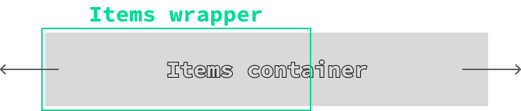

The `Carousel` component is a flexible and feature-rich solution for displaying a series of items in a sliding format. It offers support for features like pagination, navigation controls, and customizable item slots, making it ideal for showcasing images, cards, or other content in a carousel layout.

This component is built using foundational elements, including:

- [Pagination](/components/basic/pagination) for rendering pagination controls.

## Usage

To use the `Carousel` component, simply import it and include it in your JSX. You can customize it with various props and slots to suit your specific requirements.

:::tip
For detailed usage instructions, examples, and customization options, refer to the [Guide](/components/complex/carousel#guide) section.
:::

```tsx
import { For } from 'solid-js';
import Flex from '@components/Layout/Flex/Flex';
import Carousel from '@components/Complex/Carousel/Carousel';

const App = () => {
    const items = ['Item 1', 'Item 2', 'Item 3', 'Item 4', 'Item 5'];

    return (
        <Carousel style={{ width: '30vmax' }} itemWidth={40} itemGap={5} itemsAlignment='center'>
            <Carousel.Items style={{ height: '80%' }}>
                <For each={items}>
                    {(item) =>
                        <Carousel.Item
                            style-selected={{ transform: 'scale(1.1)', border: '0.2vmax solid #868599' }}
                            style={{ overflow: 'hidden', transition: 'transform 300ms', 'border-radius': '1vmax' }}
                        >
                            <Flex align-items='center' justify-content='center' style={{ background: '#3e3d5d', height: '100%' }}>
                                {item}
                            </Flex>
                        </Carousel.Item>}
                </For>
            </Carousel.Items>
            <Carousel.Pagination />
        </Carousel>
    );
};

export default App;
```

## API

### Carousel Props

| Prop Name               | Type                          | Default     | Description                                                                                                                                                                                                 |
|--------------------------|-------------------------------|-------------|-------------------------------------------------------------------------------------------------------------------------------------------------------------------------------------------------------------|
| `style`                 | `JSX.CSSProperties`          | `{}`        | Inline styles to apply directly to the carousel's wrapper element.                                                                                                                                         |
| `class`                 | `string`                     | `""`        | Additional CSS classes to apply to the carousel's wrapper element.                                                                                                                                         |
| `ref`                   | `CarouselRef \| undefined`   | `undefined` | A reference to the component, providing access to its methods and the underlying HTML element.                                                                                                             |
| `itemWidth`             | `number`                     | `100`       | Specifies the width of each carousel item as a percentage. This determines how wide each item will appear within the carousel.                                                                              |
| `itemGap`               | `number`                     | `0`         | Defines the gap between carousel items as a percentage. This determines the spacing between items in the carousel.                                                                                         |
| `itemsAlignment`        | `'start' \| 'center' \| 'end'`| `start`     | Controls the alignment of items within the carousel. Options include `start`, `center`, and `end`, which determine how items are aligned along the main axis of the carousel.                               |
| `groupItems`            | `boolean`                    | `false`     | When set to `true`, groups items together based on the `itemWidth` and `itemGap` values, enabling a page-like display where multiple items are shown at once.                                               |
| `leadingAndTrailingSpaces` | `boolean`                 | `true`      | Determines whether to add leading and trailing spaces to the items. Setting this to `false` creates a more compact layout without extra padding on the sides.                                              |

## Ref API

To interact with the `Carousel` programmatically, you can use the `CarouselRef` interface. This interface provides properties and methods to access and manipulate the component's state.

### Properties

| Property         | Type             | Description                                                                 |
|------------------|------------------|-----------------------------------------------------------------------------|
| `element`        | `HTMLDivElement` | A reference to the carousel's underlying HTML element, useful for accessing DOM properties or applying additional styles. |
| `itemsContainer` | `HTMLDivElement` | A reference to the container holding all carousel items, useful for directly manipulating the layout or applying styles to the container. |

### Methods

| Method Name               | Parameters       | Return Value | Description                                                                                                                                                                                                 |
|---------------------------|------------------|--------------|-------------------------------------------------------------------------------------------------------------------------------------------------------------------------------------------------------------|
| `next`                   | None             | `void`       | Moves the carousel to the next item. If `groupItems` is enabled, it moves to the next group of items.                                               |
| `prev`                   | None             | `void`       | Moves the carousel to the previous item. If `groupItems` is enabled, it moves to the previous group of items.                                      |
| `scrollTo`               | `page: number`   | `void`       | Scrolls the carousel to a specific page or item. The `page` parameter is zero-based, with `0` referring to the first page. If `groupItems` is enabled, it scrolls to the specified group of items.          |
| `activePage`             | None             | `number`     | Returns the index of the currently active page or item. If `groupItems` is enabled, it returns the index of the active group of items.                                                                     |
| `pagesCount`             | None             | `number`     | Returns the total number of pages or items in the carousel. If `groupItems` is enabled, it returns the total number of groups of items.                                                                    |
| `translateItemsContainer`| None             | `void`       | Translates the items container to the current active page or item. This method is used internally to update the position of the items container but can also be used manually for custom pagination logic.   |

## Slots/Components

The `Carousel` component exposes multiple slots and subcomponents that let you fully customize its layout and behavior:

- **Carousel.Items** - Container for all carousel items.
- **Carousel.Item** - Defines a single item inside `Carousel.Items`.
- **Carousel.Pagination** - Displays pagination controls.
- **Carousel.Pagination.Item** - Represents a single pagination dot or item.
- **Carousel.Pagination.Controls** - Slot for providing custom pagination controls, or disabling them entirely.
- **Carousel.Next** - Navigation button to move to the next item.
- **Carousel.Prev** - Navigation button to move to the previous item.

### Carousel.Items

`Carousel.Items` acts as the container for all carousel content. It wraps the individual `Carousel.Item` components and handles the sliding layout automatically.

You can place `Carousel.Items` anywhere inside the `Carousel` component (top, bottom, or middle). It will always apply the proper structure and styles. This makes it flexible to combine with other layout components like `Flex` or `Grid`.

For example, to display items and pagination side by side:

```tsx
<Carousel style={{ width: '30vmax' }} itemWidth={30}>
    <Flex direction="row" style={{ height: '100%' }}>
        <Carousel.Items style={{ height: '80%' }}>
            <Carousel.Item>Item 1</Carousel.Item>
            <Carousel.Item>Item 2</Carousel.Item>
            <Carousel.Item>Item 3</Carousel.Item>
            <Carousel.Item>Item 4</Carousel.Item>
        </Carousel.Items>
        <Carousel.Pagination />
    </Flex>
</Carousel>
```

#### Internal structure

Internally, `Carousel.Items` renders two nested containers:

1. **Wrapper** - Defines the visible area and hides overflow.
2. **Items container** - Holds the actual items and is translated along the X axis based on the active page/item.



This design gives you flexibility: you can apply custom styles or classes to either container, while the carousel logic is preserved.

#### Carousel.Items Props

| Prop Name  | Type                                   | Default     | Description                                                                                                                                                                                  |
| ---------- | -------------------------------------- | ----------- | -------------------------------------------------------------------------------------------------------------------------------------------------------------------------------------------- |
| `style`    | `JSX.CSSProperties`                    | `{}`        | Inline styles applied to the wrapper container.                                                                                                                             |
| `itemsContainerStyle`    | `JSX.CSSProperties`                    | `{}`        | Inline styles applied to the inner items container.                                                                                                                             |
| `class`    | `string`                               | `""`        | CSS classes applied to the wrapper container.                                                                                                                                             |
| `itemsContainerClass`    | `string`                               | `""`        | CSS classes applied to the inner items container.                                                                                                                                             |

##### Container animation

The items container uses a transform transition with a default duration of 0.2s. You can override this behavior by providing your own transition or disabling it entirely.

This can be done by applying a custom class or inline style through the `itemsContainerStyle` or `itemsContainerClass` props.

For example:

```tsx
// Increase the transition duration when switching items
<Carousel.Items itemsContainerStyle={{ transition: 'transform 0.5s' }} />

// Completely disable the transition
<Carousel.Items itemsContainerStyle={{ transition: 'none' }} />
```

### Carousel.Item

The `Carousel.Item` component defines a single item inside the `Carousel.Items` container. Each `Carousel.Item` represents one element in the carousel - this could be an image, a card, or any other type of content you'd like to showcase.

#### Carousel.Item Props

| Prop Name  | Type                                   | Default     | Description                                                                                                                                                                                  |
| ---------- | -------------------------------------- | ----------- | -------------------------------------------------------------------------------------------------------------------------------------------------------------------------------------------- |
| `style`    | `JSX.CSSProperties`                    | `{}`        | Inline styles applied directly to the carousel item element.                                                                                                                             |
| `style-selected`    | `JSX.CSSProperties`                    | `{}`        | Inline styles applied when the item is marked as selected.                                                                                                                             |
| `class`    | `string`                               | `""`        | Additional CSS classes applied to the carousel item element.                                                                                                                                             |
| `class-selected` | `string`                               | `""`        | Additional CSS classes applied when the item is selected.                                                                                                                                             |
| `selected` | `boolean` | `false` | Marks the item as the currently selected one. |

:::caution
The `style-selected`, `class-selected`, and `selected` props only take effect when the `Carousel` component has its `groupItems` prop set to false. If `groupItems` is true, these props will be ignored.
:::

#### Usage

```tsx
<Carousel style={{ width: '30vmax' }} itemWidth={30} itemGap={10} itemsAlignment='center'>
    <Carousel.Items style={{ height: '80%' }}>
        <Carousel.Item>Item 1</Carousel.Item>
        <Carousel.Item selected style-selected={{ transform: 'scale(1.1)' }}>Item 2</Carousel.Item>
        <Carousel.Item>Item 3</Carousel.Item>
        <Carousel.Item>Item 4</Carousel.Item>
    </Carousel.Items>
    <Carousel.Pagination />
</Carousel>
```

In this example, the second item is automatically positioned in the center of the carousel, marked as selected, and scaled up by `1.1` of its original size.

### Carousel.Pagination


The `Carousel.Pagination` component renders pagination controls, allowing users to navigate through carousel items via buttons or indicators. Under the hood, it uses the [Pagination](/components/basic/pagination) component, so you can leverage the same props and slots to fully customize its behavior and appearance.

You can place `Carousel.Pagination` anywhere inside the `Carousel`. It automatically syncs with the carousel's active page and items. Styling and additional classes can be applied via the `style` and `class` props.

To customize the behavior of pagination items or controls, you can use the `Carousel.Pagination.Item` and `Carousel.Pagination.Controls` slots. For instance, you can design your own buttons, indicators, or even disable them entirely.

:::note
Pagination is **disabled by default**. To enable it, you must include the `Carousel.Pagination` component within the `Carousel`.
:::

:::tip
You can disable the default pagination controls and replace them with your own using the `Carousel.Pagination.Controls` slot:

```tsx ins="<Carousel.Pagination>" ins="</Carousel.Pagination>" ins="<Carousel.Pagination.Controls style={{ display: 'none' }} />"
<Carousel style={{ width: '30vmax' }} itemWidth={30}>
    <Carousel.Items style={{ height: '80%' }}>
        <Carousel.Item>Item 1</Carousel.Item>
        <Carousel.Item>Item 2</Carousel.Item>
        <Carousel.Item>Item 3</Carousel.Item>
        <Carousel.Item>Item 4</Carousel.Item>
    </Carousel.Items>
    <Carousel.Pagination>
        <Carousel.Pagination.Controls style={{ display: 'none' }} />
    </Carousel.Pagination>
</Carousel>
```

This approach is handy when you want to hide the built-in controls and instead use `Carousel.Prev` and `Carousel.Next` components to build fully custom navigation.
:::

### Carousel.Next/Carousel.Prev


The `Carousel.Next` and `Carousel.Prev` components provide custom navigation controls for the carousel. They let users move forward or backward through the carousel items with a simple click.

These components can be placed anywhere inside the `Carousel` and will automatically sync with the carousel's active page and items. You can also customize their appearance by adding text, icons, or any other elements inside them.

#### Props

| Prop Name  | Type                                   | Default     | Description                                                                                                                                                                                  |
| ---------- | -------------------------------------- | ----------- | -------------------------------------------------------------------------------------------------------------------------------------------------------------------------------------------- |
| `style`    | `JSX.CSSProperties`                    | `{}`        | Inline styles applied directly to the next/prev button element.                                                                                                                             |
| `class`    | `string`                               | `""`        | Additional CSS classes for the next/prev button element.                                                                                                                                             |
| `class-disabled` | `string`                               | `""`        | Additional CSS classes applied when the button is disabled. Buttons are disabled automatically if there are no more items to scroll left or right.                                                                                                                                             |
| `children` | `JSX.Element` | `undefined` | Content rendered inside the button. Can be an icon, text, or any element. Defaults to an arrow icon if no content is provided. |

#### Usage

```diff lang="tsx"
<Carousel style={{ width: '30vmax' }} itemWidth={30} itemGap={10} itemsAlignment='center'>
    <Carousel.Items style={{ height: '80%' }}>
        <Carousel.Item>Item 1</Carousel.Item>
        <Carousel.Item selected style-selected={{ transform: 'scale(1.1)' }}>Item 2</Carousel.Item>
        <Carousel.Item>Item 3</Carousel.Item>
        <Carousel.Item>Item 4</Carousel.Item>
    </Carousel.Items>
+    <Flex direction='row' align-items='center'>
+        <Flex direction='row'>
+            <Carousel.Prev />
+            <Carousel.Next />
+        </Flex>
        <Carousel.Pagination >
            <Carousel.Pagination.Control style={{ display: 'none' }} />
        </Carousel.Pagination>
+    </Flex>
</Carousel>
```

In this example, the default pagination controls are hidden and replaced with the `Carousel.Prev` and `Carousel.Next` buttons. Both buttons are placed next to the pagination, allowing users to navigate between carousel items manually.

## Guide

To use the `Carousel` component effectively, start by defining your goals - how you want the items to appear and behave. The `Carousel` is designed to be flexible, so its configuration depends on whether you want to highlight individual items or focus on the entire group.

The following considerations will help you set it up:

- **Item vs. group focus**: Use the `groupItems` prop to decide whether the emphasis should be on a single selected item or the entire collection.
- **Leading and trailing space**: Control extra spacing at the start and end with the `leadingAndTrailingSpaces` prop. Setting it to `false` removes the side padding, creating a more compact layout.
- **Size and spacing**: Adjust `itemWidth` and `itemGap` to define item dimensions and spacing.
- **Alignment**: Use `itemsAlignment` (`start`, `center`, or `end`) to control how items are aligned inside the carousel.
- **Navigation**: Choose between the built-in pagination (`Carousel.Pagination`) or custom navigation controls (`Carousel.Next and Carousel.Prev`).

The following sections illustrate different approaches based on these options.

### Highlighting a Selected Item

<video src="/video/carousel/items-centered.webm" autoplay loop muted></video>

When you want to emphasize the active item, leave `groupItems={false}` or omit it. This allows you to style individual items when they are selected using the `style-selected` or `class-selected` props of `Carousel.Item`.

In the example below, each item takes up `40%` width with a `5%` gap, and the active item is centered (`itemsAlignment="center"`).

```tsx ins="itemWidth={40} itemGap={5} itemsAlignment='center'"
import { For } from 'solid-js';
import Flex from '@components/Layout/Flex/Flex';
import Carousel from '@components/Complex/Carousel/Carousel';

const App = () => {
    const items = ['Item 1', 'Item 2', 'Item 3', 'Item 4', 'Item 5'];

    return (
        <Carousel style={{ width: '30vmax' }} itemWidth={40} itemGap={5} itemsAlignment='center'>
            <Carousel.Items style={{ height: '80%' }}>
                <For each={items}>
                    {(item) =>
                        <Carousel.Item
                            style={{ overflow: 'hidden', transition: 'transform 300ms', 'border-radius': '1vmax' }}
                        >
                            <Flex align-items='center' justify-content='center' style={{ background: '#3e3d5d', height: '100%' }}>
                                {item}
                            </Flex>
                        </Carousel.Item>}
                </For>
            </Carousel.Items>
            <Carousel.Pagination />
        </Carousel>
    );
};

export default App;
```

To make the selected item stand out, add custom styles via `style-selected`:

```tsx collapse={1-12, 17-28} ins="style-selected={{ transform: 'scale(1.1)', border: '0.2vmax solid #868599' }}"
import { For } from 'solid-js';
import Flex from '@components/Layout/Flex/Flex';
import Carousel from '@components/Complex/Carousel/Carousel';

const App = () => {
    const items = ['Item 1', 'Item 2', 'Item 3', 'Item 4', 'Item 5'];

    return (
        <Carousel style={{ width: '30vmax' }} itemWidth={40} itemGap={5} itemsAlignment='center'>
            <Carousel.Items style={{ height: '80%' }}>
                <For each={items}>
                    {(item) =>
                        <Carousel.Item
                            style-selected={{ transform: 'scale(1.1)', border: '0.2vmax solid #868599' }}
                            style={{ overflow: 'hidden', transition: 'transform 300ms', 'border-radius': '1vmax' }}
                        >
                            <Flex align-items='center' justify-content='center' style={{ background: '#3e3d5d', height: '100%' }}>
                                {item}
                            </Flex>
                        </Carousel.Item>}
                </For>
            </Carousel.Items>
            <Carousel.Pagination />
        </Carousel>
    );
};

export default App;
```

#### Removing leading and trailing spaces

<video src="/video/carousel/items-center-no-spaces.webm" autoplay loop muted></video>

By default, the `Carousel` component adds extra spacing before the first item and after the last one. This helps create a more open layout with padding on the sides. If you'd rather have a compact layout without these side gaps, you can disable this behavior by setting the `leadingAndTrailingSpaces` prop to `false`.

```tsx ins="leadingAndTrailingSpaces={false}" collapse={1-8, 10-28}
import { For } from 'solid-js';
import Flex from '@components/Layout/Flex/Flex';
import Carousel from '@components/Complex/Carousel/Carousel';

const App = () => {
    const items = ['Item 1', 'Item 2', 'Item 3', 'Item 4', 'Item 5'];

    return (
        <Carousel style={{ width: '30vmax' }} itemWidth={40} itemGap={5} leadingAndTrailingSpaces={false} itemsAlignment='center'>
            <Carousel.Items style={{ height: '80%' }}>
                <For each={items}>
                    {(item) =>
                        <Carousel.Item
                            style-selected={{ transform: 'scale(1.1)', border: '0.2vmax solid #868599' }}
                            style={{ overflow: 'hidden', transition: 'transform 300ms', 'border-radius': '1vmax' }}
                        >
                            <Flex align-items='center' justify-content='center' style={{ background: '#3e3d5d', height: '100%' }}>
                                {item}
                            </Flex>
                        </Carousel.Item>}
                </For>
            </Carousel.Items>
            <Carousel.Pagination />
        </Carousel>
    );
};

export default App;
```

#### Align items differently

You can also control how items are aligned within the carousel using the `itemsAlignment` prop. Setting it to `start` or `end` shifts the items accordingly, giving the carousel a different visual flow.

**itemsAlignment='start'**

<video src="/video/carousel/items-start.webm" autoplay loop muted></video>

**itemsAlignment='end'**

<video src="/video/carousel/items-end.webm" autoplay loop muted></video>

### Page like display of items

<video src="/video/carousel/grouped-items.webm" autoplay loop muted></video>

For a page-like experience, use the `groupItems` prop. When enabled, items are grouped together based on the defined `itemWidth` and `itemGap`. Navigation will then move one group at a time instead of a single item.

:::caution
When `groupItems` is set to `true`:

- The `selected`, `style-selected`, and `class-selected` props of `Carousel.Item` are ignored.
- The `leadingAndTrailingSpaces` setting is also ignored, as the carousel will always remove side spacing in this mode.

:::

### Creating custom controls

<video src="/video/carousel/custom-pagination.webm" autoplay loop muted></video>

If you'd like to replace the default navigation buttons, you can use the `Carousel.Next` and `Carousel.Prev` components to build your own controls. You can also override or hide the built-in pagination buttons by customizing the `Carousel.Pagination.Controls` slot.

```diff lang='tsx' collapse={1-19, 31-34} ins="style={{ display: 'none' }}"
import { For } from 'solid-js';
import Flex from '@components/Layout/Flex/Flex';
import Carousel from '@components/Complex/Carousel/Carousel';

const App = () => {
    const items = ['Item 1', 'Item 2', 'Item 3', 'Item 4', 'Item 5'];

    return (
            <Carousel style={{ width: '30vmax' }} itemWidth={40} itemGap={5} itemsAlignment='center'>
                <Carousel.Items style={{ height: '80%' }}>
                    <For each={items}>
                        {(item) => <Carousel.Item
                            style-selected={{ transform: 'scale(1.1)', border: '0.2vmax solid #868599' }}
                            style={{ overflow: 'hidden', transition: 'transform 300ms', "border-radius": '1vmax' }}>
                            <Flex align-items='center' justify-content='center' style={{ background: '#3e3d5d', height: '100%' }}>
                                {item}
                            </Flex>
                        </Carousel.Item>}
                    </For>
                </Carousel.Items>
+                <Flex style={{ width: '100%' }} direction='row' justify-content='space-between'>
+                    <Flex direction='row'>
+                        <Carousel.Prev />
+                        <Carousel.Next />
+                    </Flex>
+                    <Carousel.Pagination >
+                        <Carousel.Pagination.Control style={{ display: 'none' }}></Carousel.Pagination.Control>
+                    </Carousel.Pagination>
+                </Flex>
            </Carousel>
    );
};

export default App;
```

### Adding custom scrolling behavior

You can also control the carousel programmatically using a `CarouselRef` in combination with `next` and `prev` methods that lets you scroll to the next or previous item.

With this approach, you can add custom navigation logic - for example, scrolling when certain keyboard keys are pressed, or when the user scrolls the mouse wheel.

#### Scrolling with the mouse wheel

<video src="/video/carousel/mouse-wheel.webm" autoplay loop muted></video>

To enable mouse wheel scrolling, simply listen for the `wheel` event on the carousel element and call `ref.next()` or `ref.prev()` depending on the scroll direction.

```diff lang='tsx' ins="ref={ref} wheel={scrollCarousel}" collapse={1-4, 17-34}
import { For } from 'solid-js';
import Flex from '@components/Layout/Flex/Flex';
import Carousel, { CarouselRef } from '@components/Complex/Carousel/Carousel';

const App = () => {
    const items = ['Item 1', 'Item 2', 'Item 3', 'Item 4', 'Item 5'];
+    let ref!: CarouselRef;

+    const scrollCarousel = (event: WheelEvent) => {
+        event.preventDefault();
+        event.deltaY > 0 ? ref.next() : ref.prev()
+    };

    return (
+        <Carousel ref={ref} wheel={scrollCarousel} style={{ width: '30vmax' }} itemWidth={40} itemGap={5} itemsAlignment='center'>
            <Carousel.Items style={{ height: '80%' }}>
                <For each={items}>
                    {(item) =>
                        <Carousel.Item
                            style-selected={{ transform: 'scale(1.1)', border: '0.2vmax solid #868599' }}
                            style={{ overflow: 'hidden', transition: 'transform 300ms', "border-radius": '1vmax' }}
                        >
                            <Flex align-items='center' justify-content='center' style={{ background: '#3e3d5d', height: '100%' }}>
                                {item}
                            </Flex>
                        </Carousel.Item>}
                </For>
            </Carousel.Items>
            <Carousel.Pagination />
        </Carousel>
    );
};

export default App;
```

#### Keyboard arrow keys scrolling

You can also navigate the carousel using the keyboard's arrow keys. Simply add a `keydown` listener and call the `next` or `prev` methods depending on which key is pressed.

```diff lang="tsx" ins="ref={ref}" collapse={1-4, 25-40}
import { For, onMount, onCleanup } from 'solid-js';
import Flex from '@components/Layout/Flex/Flex';
import Carousel, { CarouselRef } from '@components/Complex/Carousel/Carousel';

const App = () => {
    const items = ['Item 1', 'Item 2', 'Item 3', 'Item 4', 'Item 5'];
+    let ref!: CarouselRef;

+    const scrollCarouselWithKey = (event: KeyboardEvent) => {
+        event.preventDefault();
+        event.keyCode === 39 ? ref.next() : event.keyCode === 37 ? ref.prev() : null;
+    };

+    onMount(() => {
+        document.addEventListener('keydown', scrollCarouselWithKey);
+    });

+    onCleanup(() => {
+        document.removeEventListener('keydown', scrollCarouselWithKey);
+    });

    return (
+        <Carousel ref={ref} style={{ width: '30vmax' }} itemWidth={40} itemGap={5} itemsAlignment='center'>
            <Carousel.Items style={{ height: '80%' }}>
                <For each={items}>
                    {(item) =>
                        <Carousel.Item
                            style-selected={{ transform: 'scale(1.1)', border: '0.2vmax solid #868599' }}
                            style={{ overflow: 'hidden', transition: 'transform 300ms', "border-radius": '1vmax' }}
                        >
                            <Flex align-items='center' justify-content='center' style={{ background: '#3e3d5d', height: '100%' }}>
                                {item}
                            </Flex>
                        </Carousel.Item>}
                </For>
            </Carousel.Items>
            <Carousel.Pagination />
        </Carousel>
    );
};

export default App;
```

#### Continuous scrolling while holding down

<video src="/video/carousel/continuous-scrolling.webm" autoplay loop muted></video>

You can also enable continuous scrolling when a button is held down. To achieve this:

- Use [custom controls](#creating-custom-controls) with `Carousel.Next` and `Carousel.Prev`.
  - Pass empty `click` handlers to disable their default behavior.
- Create a function that repeatedly triggers scrolling while the button is held.
  - Use `setTimeout` for the initial delay and `setInterval` for continuous scrolling.
- Add a `mouseup` listener to stop the scroll when the button is released.

```diff lang="tsx"
import { For, onMount, onCleanup } from 'solid-js';
import Flex from '@components/Layout/Flex/Flex';
import Carousel, { CarouselRef } from '@components/Complex/Carousel/Carousel';

const App = () => {
    const items = ['Item 1', 'Item 2', 'Item 3', 'Item 4', 'Item 5'];
+    let ref!: CarouselRef;
+    let bounceTimeout: any, bounceInterval: any;

+   const bounce = (scrollCarouselCallback: () => void) => {
+        return () => {
+            scrollCarouselCallback();
+            // Add event listener for mouseup to stop the continuous scrolling
+            document.addEventListener('mouseup', clearTimers, { once: true });
+            // Clear any existing timeouts or intervals
+            clearTimers();
+
+            bounceTimeout = setTimeout(() => {
+                bounceInterval = setInterval(() => {
+                    scrollCarouselCallback();
+                }, 100);
+            }, 200)
+        }
+    }
+
+    const clearTimers = () => {
+        if (bounceTimeout) {
+            clearTimeout(bounceTimeout);
+            bounceTimeout = null;
+        }
+
+        if (bounceInterval) {
+            clearInterval(bounceInterval);
+            bounceInterval = null;
+        }
+    }

    return (
+        <Carousel ref={ref} style={{ width: '30vmax' }} itemWidth={40} itemGap={5} itemsAlignment='center'>
            <Carousel.Items style={{ height: '80%' }}>
                <For each={items}>
                    {(item) => <Carousel.Item
                        style-selected={{ transform: 'scale(1.1)', border: '0.2vmax solid #868599' }}
                        style={{ overflow: 'hidden', transition: 'transform 300ms', "border-radius": '1vmax' }}>
                        <Flex align-items='center' justify-content='center' style={{ background: '#3e3d5d', height: '100%' }}>
                            {item}
                        </Flex>
                    </Carousel.Item>}
                </For>
            </Carousel.Items>
+            <Flex style={{ width: '100%' }} direction='row' justify-content='space-between'>
+                <Flex direction='row'>
+                    <Carousel.Prev click={() => { }} mousedown={bounce(() => ref.prev())} />
+                    <Carousel.Next click={() => { }} mousedown={bounce(() => ref.next())} />
+                </Flex>
                <Carousel.Pagination >
+                    <Carousel.Pagination.Control style={{ display: 'none' }}></Carousel.Pagination.Control>
                </Carousel.Pagination>
+            </Flex>
        </Carousel>
    );
};

export default App;
```
