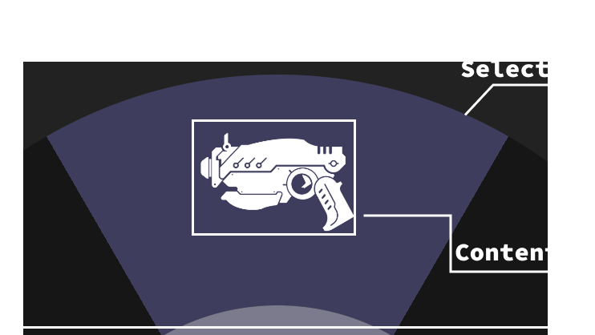

The `RadialMenu` component is an interactive circular menu designed for quick selection among multiple options arranged radially around a center point. 
It supports mouse and controller input, visual indicators, and customizable slice spacing, making it ideal for in-game weapon wheels, tool selectors, or compact UI menus.

## Usage

To use the `Radial-menu` component, simply import it and include it in your JSX. You can customize it with various props and slots to suit your specific requirements.

:::tip
For detailed usage instructions, examples, and customization options, refer to the [Guide](/components/complex/radial-menu#guide) section.
:::

```tsx collapse={1-8}
// Assets import
import Weapon1 from "@assets/wheel/weapon1.png";
import Weapon2 from "@assets/wheel/weapon2.png";
import Weapon3 from "@assets/wheel/weapon3.png";
import Weapon4 from "@assets/wheel/weapon4.png";
import Weapon5 from "@assets/wheel/weapon5.png";
import Weapon6 from "@assets/wheel/weapon6.png";
import Center from "@assets/wheel/GameMessage_AchievmentIcon.png";
import { For } from 'solid-js';
import RadialMenu from "@components/Complex/RadialMenu/RadialMenu";
import BackgroundImage from "@components/Media/BackgroundImage/BackgroundImage";

const wheelItems = [
    { id: "shotgun", img: Weapon1 },
    { id: "pistol", img: Weapon2 },
    { id: "rifle", img: Weapon3 },
    { id: "sniper", img: Weapon4 },
    { id: "smg", img: Weapon5 },
    { id: "grenade", img: Weapon6 },
]
const App = () => {
    return (
        <RadialMenu opened>
            <RadialMenu.Content  style={{width: '50%', height: '50%'}}>
                <BackgroundImage style={{width: '80%', height: '80%'}} src={Center} options={{size: 'contain', position: "center" }} />
            </RadialMenu.Content>
            <For each={wheelItems}>
                {(item) => (
                    <RadialMenu.Item id={item.id}>
                        <div style={{ width: '5vmax', height: '5vmax' }}>
                            <BackgroundImage fill src={item.img} options={{size: 'contain', position: "center" }} />
                        </div>
                    </RadialMenu.Item>
                )}
            </For>
        </RadialMenu>
    );
};

export default App;
```

## API

### RadialMenu Props

| Prop Name       | Type                             | Default     | Description                                                                                                                                                     |
| --------------- | -------------------------------- | ----------- | --------------------------------------------------------------------------------------------------------------------------------------------------------------- |
| `style`         | `JSX.CSSProperties`              | `{}`        | Inline styles to apply directly to the radial menu's root element.                                                                                              |
| `class`         | `string`                         | `""`        | Additional CSS classes to apply to the radial menu's root element.                                                                                              |
| `ref`           | `RadialMenuRef \| undefined`     | `undefined` | A reference to the component, providing access to its methods and the underlying HTML element.                                                                  |
| `opened`        | `boolean`                        | `false`     | Controls whether the radial menu is initially open and interactive. When `false`, input handling and visual updates are paused.                                 |
| `gap`           | `number`                         | `0`         | Defines the spacing between adjacent slices of the menu, expressed as a percentage of the radius. A larger value increases the visual separation between items. |
| `selected`      | `number`                         | `0`         | The index of the initially selected item in the menu.                                         |
| `onChange`      | `(id: string \| number) => void` | `undefined` | Callback triggered when a new item becomes selected. Returns either the item's `id` (if defined) or its index.                                                  |
| `onItemChanged` | `() => void`                     | `undefined` | Callback executed when the number or order of menu items changes (e.g., due to re-rendering or dynamic updates).                                                |

## Ref API

To interact with the `RadialMenu` programmatically, you can use the `RadialMenuRef` interface. This interface provides access to the component's root element and exposes methods for controlling its state and selection.

### Properties

| Property  | Type             | Description                                                                                  |
| --------- | ---------------- | -------------------------------------------------------------------------------------------- |
| `element` | `HTMLDivElement` | A reference to the `radial menu`'s root HTML element, useful for direct DOM access or styling. |

### Methods

| Method Name      | Parameters             | Return Value | Description                                                                                                                                                                  |
| ---------------- | ---------------------- | ------------ | ---------------------------------------------------------------------------------------------------------------------------------------------------------------------------- |
| `open`           | None                   | `void`       | Opens the `radial menu`, enabling input handling and rendering active selection states.                                                                                        |
| `close`          | None                   | `void`       | Closes the `radial menu`, disabling input tracking and freezing the current selection.                                                                                         |
| `opened`         | None                   | `boolean`    | Returns the current visibility state of the component.                                                                                         |
| `changeGap`      | `value: number`        | `void`       | Dynamically adjusts the spacing between slices, allowing smooth transitions or effects that depend on menu density.                                                          |
| `selectByIndex`  | `index: number`        | `void`       | Selects a menu item by its zero-based index. Triggers the `onChange` event if the selection changes.                                                                         |
| `selectByVector` | `x: number, y: number` | `void`       | Selects a menu item based on normalized vector coordinates (range `-1` to `1`), useful for controller or joystick input. Includes an internal deadzone for stable selection. |

## Slots

The `RadialMenu` component exposes multiple slots that allow you to customize its structure, visuals, and behavior:

- [**RadialMenu.Item**](/components/complex/radial-menu#radialmenuitem) - Defines an individual slice (menu option) displayed around the wheel.
- [**RadialMenu.Selector**](/components/complex/radial-menu#radialmenuselector) - Visual layer for the colored wedge of each item, representing its selected state.
- [**RadialMenu.Content**](/components/complex/radial-menu#radialmenucontent) - Container for the central content of the menu (e.g., icons, labels, or contextual info).
- [**RadialMenu.Indicator**](/components/complex/radial-menu#radialmenuindicator) - Represents the rotating half-arc that highlights the currently selected item or follows cursor/controller movement.
- [**RadialMenu.Icon**](/components/complex/radial-menu#radialmenuicon) - Optional element positioned at the center of the `Indicator`, can be used to display an icon or pointer.

### RadialMenu.Item

The `RadialMenu.Item` slot defines a single slice (menu option) within the radial menu. Each `RadialMenu.Item` you render creates **one slice** in the wheel.

#### Usage

```tsx
<RadialMenu opened>
    <RadialMenu.Item offset="2vmax" style={{transition: 'transform 0.2s linear'}} style-selected={{ transform: 'scale(1.1)' }} >
        <div style={{ width: '5vmax', height: '5vmax' }}>
            <BackgroundImage fill src={item.img} options={{size: 'contain', position: "center" }} />
        </div>
    </RadialMenu.Item>
    <RadialMenu.Item offset="2vmax" style={{transition: 'transform 0.2s linear'}} style-selected={{ transform: 'scale(1.1)' }} >
        <div style={{ width: '5vmax', height: '5vmax', 'background-color': 'aqua' }}></div>
    </RadialMenu.Item>
</RadialMenu>
```

#### Internal structure (advanced)

Structurally, each item in the `RadialMenu` starts as a square element with a `border-radius` of `50%`, effectively turning it into a circle.  
The circular shape is then divided into slices using the CSS `clip-path` property. Each item is clipped to a specific wedge size, determined by the total number of items in the menu.  
Once clipped, the slices are evenly rotated around the center, forming the complete radial layout.

Internally, each `RadialMenu.Item` is composed of three layers that work together to form the visual and interactive slice of the menu:

- **Selector** - the colored wedge behind the item's content, visually representing its active or selected state.  
- **Content** - the user-provided content inside the slot (e.g., an icon or label). It remains visually upright through counter-rotation, even as the menu spins.  
- **Wrapper** - the outer container that holds the elements. It manages spacing, transforms, and event handling for the item.



:::tip
In most cases, you only need to place an image, icon, or any content inside the `RadialMenu.Item` slot — everything else is handled automatically.  
However, if you plan to create a fully custom look or integrate the radial layout into a unique design system, understanding how the component's internal structure works will help you modify it confidently.
:::

#### Props

| Prop Name        | Type                | Default     | Description                                                                                                      |
| ---------------- | ------------------- | ----------- | ---------------------------------------------------------------------------------------------------------------- |
| `style`          | `JSX.CSSProperties` | `{}`        | Inline styles applied to the item's outer wrapper.                                                               |
| `style-selected` | `JSX.CSSProperties` | `{}`        | Inline styles applied to the item's outer wrapper **only when this item is selected**. Useful for scale, glow, or emphasis effects.          |
| `class`          | `string`            | `""`        | Additional CSS classes applied to the item's outer wrapper.                                                      |
| `class-selected` | `string`            | `""`        | Additional CSS classes applied to the item's outer wrapper **only when this item is selected**.                                              |
| `id`             | `string`            | `undefined` | Stable identifier emitted by `onChange`. If omitted, the item's index is used.                                   |
| `offset`         | `string`            | `1vmax` | Optional vertical padding (CSS size) that nudges the item's content toward/away from the ring (e.g., `"1vmax"`). |


### RadialMenu.Selector

The `RadialMenu.Selector` slot defines the **colored wedge** of each `RadialMenu.Item`.  
It serves as the visual slice that fills the area behind the item's content and represents its active or selected state.

#### Usage

The `Selector` slot is the main way to customize the **appearance and size** of each slice.  
Adjusting the selector's `border-width` controls how thick each wedge appears, while the `border-color` defines the base color of that slice.  
By providing a `style-selected` or `class-selected`, you can also control how the selected item visually changes when active.

```tsx
<RadialMenu opened>
    <RadialMenu.Selector style={{"border-width": '5vmax', 'border-color': 'rgba(0,0,80, 0.35)'}} style-selected={{'border-color': 'rgb(0,0,80)'}} />
    {/* Items */}
</RadialMenu>
```

#### Props

| Prop Name        | Type                | Default | Description                                                                                                                 |
| ---------------- | ------------------- | ------- | --------------------------------------------------------------------------------------------------------------------------- |
| `style`          | `JSX.CSSProperties` | `{}`    | Inline styles applied directly to the selector wedge. Used to define the base look of each slice.                           |
| `style-selected` | `JSX.CSSProperties` | `{}`    | Inline styles applied when the parent item is selected. Use this to visually distinguish the active slice.                  |
| `class`          | `string`            | `""`    | Additional CSS classes applied to the selector wedge. Used to define the base look of each slice.                           |
| `class-selected` | `string`            | `""`    | CSS classes applied when the parent item is selected. Use this to visually distinguish the active slice.                    |

### RadialMenu.Content

The `RadialMenu.Content` slot represents the **inner area** of the radial menu — the circular space at its center.  
It's primarily used to display any content that should remain static and upright while the outer slices rotate, such as icons, labels, player stats, or contextual information.

You can place any custom content inside the `RadialMenu.Content` slot.  
This slot remains fixed in the center and doesn't rotate along with the slices.

```tsx
<RadialMenu opened>
    <RadialMenu.Content style={{'background-color': '#333', border: '1vmax solid #3e3d5d'}}>
        <h3>Weapons</h3>
        <div>Current weapon info</div>
    </RadialMenu.Content>
    {/* Items */}
</RadialMenu>
```

#### Props

| Prop Name | Type                | Default | Description                                              |
| --------- | ------------------- | ------- | -------------------------------------------------------- |
| `style`   | `JSX.CSSProperties` | `{}`    | Inline styles applied directly to the content container. |
| `class`   | `string`            | `""`    | Additional CSS classes applied to the content container. |

### RadialMenu.Indicator

The `RadialMenu.Indicator` is an optional slot that represents the **rotating arc** or **marker** that follows the current selection around the menu.  
It visually indicates which slice is active or which direction the user is pointing toward (for example, when using a joystick or mouse).

This slot can also contain an optional `RadialMenu.Indicator.Icon`, which stays attached to the indicator's center and rotates alongside it.

#### Usage

To display the indicator simply provide it inside the `RadialMenu` component.

```tsx
<RadialMenu>
    <RadialMenu.Indicator style={{ "border-width": "5vmax", "border-color": "rgba(255,255,255,0.2)" }} />
    {/* Items */}
</RadialMenu>
```

#### Props

| Prop Name | Type                | Default | Description                                                                                      |
| --------- | ------------------- | ------- | ------------------------------------------------------------------------------------------------ |
| `style`   | `JSX.CSSProperties` | `{}`    | Inline styles applied to the indicator arc. |
| `class`   | `string`            | `""`    | Additional CSS classes applied to the indicator arc.                                             |

### RadialMenu.Icon

The `RadialMenu.Icon` slot is an **optional element** that appears at the center of the `RadialMenu.Indicator`.  
It's used to visually represent the pointer or direction of the active slice.

If you **don't provide any children** inside the slot, a **default arrow-shaped placeholder** will be rendered automatically.  
This placeholder can be fully customized through the slot's `style` and `class` props.  
If you **do provide content** (e.g., an image or SVG), it will **override the default icon** and render your custom content instead.

#### Usage

```tsx
<RadialMenu opened>
    <RadialMenu.Indicator>
        <RadialMenu.Indicator.Icon style={{width: '1vmax', height: '1vmax'}}>
            <Image fill src={CustomIcon} />
        </RadialMenu.Indicator.Icon>
    </RadialMenu.Indicator>
</RadialMenu>
```

:::caution
When you provide a custom icon, all **default styles** of the `RadialMenu.Icon` slot are overridden.  
This means you may need to manually define its dimensions or layout styles — for example, setting explicit `width` and `height` — if your custom image doesn't appear as expected.
:::

#### Props

| Prop Name | Type                | Default | Description                                                        |
| --------- | ------------------- | ------- | ------------------------------------------------------------------ |
| `style`   | `JSX.CSSProperties` | `{}`    | Inline styles applied directly to the icon or placeholder element. |
| `class`   | `string`            | `""`    | Additional CSS classes applied to the icon or placeholder element. |

## Guide

### Customizing the Selected Item

You can customize the look of the **selected item** through the `class-selected` and `style-selected` props of either the `RadialMenu.Selector` or the `RadialMenu.Item` slots — depending on what you want to modify.

- To **change the highlight or color** of the selected slice, customize the `RadialMenu.Selector`.  
- To **alter the appearance of the entire item** (e.g., scale, glow, border), customize the `RadialMenu.Item`.

<video style={{width: '50%'}} src="/video/radial-menu/item-highlight.webm" autoplay loop muted></video>

In the following example, the selected item grows slightly larger when selected, and the highlight color changes to a custom shade of blue.

```tsx collapse={1-21} ins="style-selected={{ transform: 'scale(1.1)' }}" ins="style-selected={{ 'border-color': 'rgba(0, 0, 120, 0.5)' }}"
// Assets import
import Weapon1 from "@assets/wheel/weapon1.png";
import Weapon2 from "@assets/wheel/weapon2.png";
import Weapon3 from "@assets/wheel/weapon3.png";
import Weapon4 from "@assets/wheel/weapon4.png";
import Weapon5 from "@assets/wheel/weapon5.png";
import Weapon6 from "@assets/wheel/weapon6.png";
import Center from "@assets/wheel/GameMessage_AchievmentIcon.png";
import { For } from 'solid-js';
import RadialMenu from "@components/Complex/RadialMenu/RadialMenu";
import BackgroundImage from "@components/Media/BackgroundImage/BackgroundImage";

const wheelItems = [
    { id: "shotgun", img: Weapon1 },
    { id: "pistol", img: Weapon2 },
    { id: "rifle", img: Weapon3 },
    { id: "sniper", img: Weapon4 },
    { id: "smg", img: Weapon5 },
    { id: "grenade", img: Weapon6 },
]

const App = () => {
    return (
        <RadialMenu opened>
            <RadialMenu.Content>
                <BackgroundImage src={Center} options={{size: 'contain', position: "center" }} />
            </RadialMenu.Content>
            <RadialMenu.Indicator />
            <RadialMenu.Selector style-selected={{ 'border-color': 'rgba(0, 0, 120, 0.5)' }} />
            <For each={wheelItems}>
                {(item) => (
                    <RadialMenu.Item 
                        id={item.id} 
                        style={{transition: 'transform 0.2s linear'}} 
                        style-selected={{ transform: 'scale(1.1)' }}>
                        <div style={{ width: '5vmax', height: '5vmax'  }}>
                            <BackgroundImage fill src={item.img} options={{size: 'contain', position: "center" }} />
                        </div>
                    </RadialMenu.Item>
                )}
            </For>
        </RadialMenu>
    );
};

export default App;
```

:::tip
To customize the appearance of items **when they're not selected**, simply apply regular `class` or `style` props to the `RadialMenu.Selector`.  
These define the default look of each slice before a selection occurs.
:::

### Reacting to Item Changes

To handle item selection changes in the `RadialMenu`, use the `onChange` prop.  
This prop accepts a callback function that receives the `id` of the newly selected item as its argument.

#### Displaying the Selected Item in the Center

<video style={{width: '50%'}} src="/video/radial-menu/item-change.webm" autoplay loop muted></video>

In the following example, we store the currently selected item in a `signal` and update it whenever the user changes their selection.  
The `id` of the selected item is then displayed inside the `RadialMenu.Content` slot.

```tsx collapse={1-21} collapse={30-44} ins="const [currentItem, setCurrentItem] = createSignal(wheelItems[0]);" ins="onChange={(id) => setCurrentItem(id)}"  ins="${currentItem()}"
// Assets import
import Weapon1 from "@assets/wheel/weapon1.png";
import Weapon2 from "@assets/wheel/weapon2.png";
import Weapon3 from "@assets/wheel/weapon3.png";
import Weapon4 from "@assets/wheel/weapon4.png";
import Weapon5 from "@assets/wheel/weapon5.png";
import Weapon6 from "@assets/wheel/weapon6.png";
import Center from "@assets/wheel/GameMessage_AchievmentIcon.png";
import { For } from 'solid-js';
import RadialMenu from "@components/Complex/RadialMenu/RadialMenu";
import BackgroundImage from "@components/Media/BackgroundImage/BackgroundImage";

const wheelItems = [
    { id: "shotgun", img: Weapon1 },
    { id: "pistol", img: Weapon2 },
    { id: "rifle", img: Weapon3 },
    { id: "sniper", img: Weapon4 },
    { id: "smg", img: Weapon5 },
    { id: "grenade", img: Weapon6 },
]

const App = () => {
    const [currentItem, setCurrentItem] = createSignal(wheelItems[0]);
    return (
        <RadialMenu opened selected={currentItem()} gap={0.5} onChange={(id) => setCurrentItem(id)}>
            <RadialMenu.Selector style={{"border-width": '5vmax'}} />
            <RadialMenu.Content style={{'background-color': '#333', border: '1vmax solid #3e3d5d'}}>
                <div style={{'font-size': '1vmax'}}>{`Selected item: ${currentItem()}`}</div>
            </RadialMenu.Content>
            <RadialMenu.Indicator />
            <For each={wheelItems}>
                {(item) => (
                    <RadialMenu.Item id={item.id} offset="0.75vmax" >
                        <div style={{ width: '3.5vmax', height: '3.5vmax'  }}>
                            <BackgroundImage fill src={item.img} options={{size: 'contain', position: "center" }} />
                        </div>
                    </RadialMenu.Item>
                )}
            </For>
        </RadialMenu>
    );
};

export default App;
```

### Alternative Selection Methods (programmatic selection)

When the `RadialMenu` is open, it automatically reacts to `mousemove` events and continuously tracks the cursor position until it's closed.

Beyond this default behavior, items can also be selected programmatically in two additional ways:

- Using the `selectByIndex` method from the component's `ref`, providing a valid item index.
- Using the `selectByVector` method from the component's `ref`, providing normalized X and Y values (ranging from -1 to 1). This approach is ideal for mapping to a gamepad stick.

#### Selecting an item by index

To select an item by its index:

1. Declare a variable and assign it the `RadialMenuRef` type.  
2. Pass that variable to the `ref` prop of the `RadialMenu` component.  
3. Call `ref.selectByIndex()` and provide a valid index as the argument.

In the following example, pressing the keys **1-6** on the keyboard will select the corresponding item in the `RadialMenu`.

<video style={{width: '50%'}} src="/video/radial-menu/key-item-change.webm" autoplay loop muted></video>

```diff lang="tsx" collapse={1-21} collapse={37-52}
// Assets import
import Weapon1 from "@assets/wheel/weapon1.png";
import Weapon2 from "@assets/wheel/weapon2.png";
import Weapon3 from "@assets/wheel/weapon3.png";
import Weapon4 from "@assets/wheel/weapon4.png";
import Weapon5 from "@assets/wheel/weapon5.png";
import Weapon6 from "@assets/wheel/weapon6.png";
import Center from "@assets/wheel/GameMessage_AchievmentIcon.png";
import { For, onCleanup, onMount } from 'solid-js';
import BackgroundImage from "@components/Media/BackgroundImage/BackgroundImage";
import RadialMenu, { RadialMenuRef } from "@components/Complex/RadialMenu/RadialMenu";

const wheelItems = [
    { id: "shotgun", img: Weapon1 },
    { id: "pistol", img: Weapon2 },
    { id: "rifle", img: Weapon3 },
    { id: "sniper", img: Weapon4 },
    { id: "smg", img: Weapon5 },
    { id: "grenade", img: Weapon6 },
]

const App = () => {
+    let ref: RadialMenuRef;
+    const handleKeyPress = (e: KeyboardEvent) => {
+        if (e.key >= "1" && e.key <= "6") {
+            const index = Number(e.key) - 1; // convert '1'..'6' to 0..5
+            ref!.selectByIndex(index);
+        }
+    }

+    onMount(() => window.addEventListener("keydown", handleKeyPress));
+    onCleanup(() => window.removeEventListener("keydown", handleKeyPress)); 

    return (
+       <RadialMenu ref={ref!} opened selected={2} >
            <RadialMenu.Content  style={{width: '50%', height: '50%'}}>
                <BackgroundImage style={{width: '80%', height: '80%'}} src={Center} options={{size: 'contain', position: "center" }} />
            </RadialMenu.Content>
            <For each={wheelItems}>
                {(item) => (
                    <RadialMenu.Item id={item.id} >
                        <div style={{ width: '5vmax', height: '5vmax',  }}>
                            <BackgroundImage fill src={item.img} options={{size: 'contain', position: "center" }} />
                        </div>
                    </RadialMenu.Item>
                )}
            </For>
        </RadialMenu>
    );
};

export default App;
```

#### Selecting an item with gamepad stick (by vector)

To select an item using a gamepad stick:

1. Declare a variable and assign it the `RadialMenuRef` type.  
2. Pass that variable to the `ref` prop of the `RadialMenu` component.  
3. Call `ref.selectByVector()` and provide valid `x` and `y` coordinates representing the stick direction.

In the following example, each frame reads the coordinates of the **right stick** and passes them to the `RadialMenu` to change the active item dynamically.

<video style={{width: '50%'}} src="/video/radial-menu/gamepad-item-change.webm" autoplay loop muted></video>

```diff lang="tsx" collapse={1-21} collapse={39-52}
// Assets import
import Weapon1 from "@assets/wheel/weapon1.png";
import Weapon2 from "@assets/wheel/weapon2.png";
import Weapon3 from "@assets/wheel/weapon3.png";
import Weapon4 from "@assets/wheel/weapon4.png";
import Weapon5 from "@assets/wheel/weapon5.png";
import Weapon6 from "@assets/wheel/weapon6.png";
import Center from "@assets/wheel/GameMessage_AchievmentIcon.png";
import { For, onCleanup, onMount } from 'solid-js';
import BackgroundImage from "@components/Media/BackgroundImage/BackgroundImage";
import RadialMenu, { RadialMenuRef } from "@components/Complex/RadialMenu/RadialMenu";

const wheelItems = [
    { id: "shotgun", img: Weapon1 },
    { id: "pistol", img: Weapon2 },
    { id: "rifle", img: Weapon3 },
    { id: "sniper", img: Weapon4 },
    { id: "smg", img: Weapon5 },
    { id: "grenade", img: Weapon6 },
]

const App = () => {
+    let ref: RadialMenuRef;
+    const updateGamepad = () => {
+        const gp = navigator.getGamepads()[0];
+        if (gp) {
+            const x = gp.axes[2]; // right stick X
+            const y = gp.axes[3]; // right stick Y
+            ref!.selectByVector(x, y);
+        }
+        requestAnimationFrame(updateGamepad);
+    };

+    onMount(() => requestAnimationFrame(updateGamepad));

    return (
+       <RadialMenu ref={ref!} opened >
            <RadialMenu.Indicator />
            <For each={wheelItems}>
                {(item) => (
                    <RadialMenu.Item id={item.id} >
                        <div style={{ width: '5vmax', height: '5vmax',  }}>
                            <BackgroundImage fill src={item.img} options={{size: 'contain', position: "center" }} />
                        </div>
                    </RadialMenu.Item>
                )}
            </For>
        </RadialMenu>
    );
};

export default App;
```

:::caution
The `updateGamepad` function in this example is intended for demonstration purposes and is **not optimized for production use**.  
For robust and configurable gamepad integration, we recommend using our 
<a href="https://frontend-tools.coherent-labs.com/interaction-manager/features/gamepad/" target="_blank" rel="noopener noreferrer">Interaction Manager</a> library.
:::

### Opening and Closing the Menu

To control the visibility of the `RadialMenu`, use the `open()` and `close()` methods from its `ref`.  
You can also use the `opened` signal provided by the component to check its current visibility state.

<video style={{width: '50%'}} src="/video/radial-menu/menu-toggle.webm" autoplay loop muted></video>

In the following example, the menu is hidden by default and only opens while the **Shift** key is being held down.

```diff lang="tsx" collapse={1-19} collapse={39-52}
import Weapon1 from "@assets/wheel/weapon1.png";
import Weapon2 from "@assets/wheel/weapon2.png";
import Weapon3 from "@assets/wheel/weapon3.png";
import Weapon4 from "@assets/wheel/weapon4.png";
import Weapon5 from "@assets/wheel/weapon5.png";
import Weapon6 from "@assets/wheel/weapon6.png";
import Center from "@assets/wheel/GameMessage_AchievmentIcon.png";
import { For } from 'solid-js';
import RadialMenu, {RadialMenuRef} from "@components/Complex/RadialMenu/RadialMenu";
import BackgroundImage from "@components/Media/BackgroundImage/BackgroundImage";

const wheelItems = [
    { id: "shotgun", img: Weapon1 },
    { id: "pistol", img: Weapon2 },
    { id: "rifle", img: Weapon3 },
    { id: "sniper", img: Weapon4 },
    { id: "smg", img: Weapon5 },
    { id: "grenade", img: Weapon6 },
]

const App = () => {
+    let ref: RadialMenuRef;
+    const handleKeyDown = (e: KeyboardEvent) => {
+        if (e.keyCode === 16 && !(ref!.opened())) ref!.open();
+        setPressedKey(e.code);
+    }
+
+    const handleKeyUp = (e: KeyboardEvent) => {
+        if (e.keyCode === 16 && ref!.opened()) ref!.close();
+        setPressedKey(e.code);
+    }

    return (
+        <RadialMenu ref={ref!} gap={1.5}>
            <RadialMenu.Content style={{'background-color': 'transparent'}} />
            <RadialMenu.Indicator style={{'border-color': '#3e3d5d70'}}/>
            <For each={wheelItems}>
                {(item) => (
                    <RadialMenu.Item id={item.id} style={{transition: 'transform 0.2s linear'}} style-selected={{ transform: 'scale(1.1)' }}>
                        <div style={{ width: '5vmax', height: '5vmax'  }}>
                            <BackgroundImage fill src={item.img} options={{size: 'contain', position: "center" }} />
                        </div>
                    </RadialMenu.Item>
                )}
            </For>
        </RadialMenu>
    );
};

export default App;
```