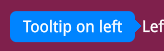

The `Tooltip` component is a flexible and customizable way to display contextual information when users hover, focus, or click on an element. It improves usability by providing additional context without overcrowding the interface.

## Usage

The `Tooltip` works by wrapping a target element inside a relatively positioned container and displaying a tooltip message absolutely positioned relative to that target. This ensures the tooltip stays aligned with the element it describes. The tooltip's style and behavior can be customized to fit your UI.

The component uses event listeners to detect user interaction with the target element and shows or hides the tooltip accordingly. It also supports multiple placement options (`top`, `bottom`, `left`, `right`, or `auto`) to ensure the tooltip is displayed in the most visible position based on available space.

Using the `Tooltip` component is simple. Import the `createTooltip` factory function, configure it if necessary, and wrap any element with the `Tooltip` wrapper:

```tsx
import createTooltip from '@components/Feedback/Tooltip/tooltip';
import { ParentComponent } from 'solid-js';

const CustomTooltip: ParentComponent<{ title: string, message: string }> = (props) => {
    return <div style={{ position: 'relative', 'background-color': 'rgb(0, 132, 255)', 'justify-content': 'center', 'border-radius': '0.5vmax', padding: '0.5vmax 1vmax', color: 'white', display: 'flex', 'flex-direction': 'column' }}>
        <h2 style={{ margin: 0 }}>{props.title}</h2>
        <span>{props.message}</span>
    </div>
}

const App = () => {
    const Tooltip = createTooltip({ content: CustomTooltip, action: "hover", position: "bottom" });

    return (
        <Tooltip style={{ display: 'flex', "justify-content": 'center', color: 'white', width: '100%' }} title="Tooltip title" message="Tooltip text">
            <div>Hover for more info</div>
        </Tooltip>
    );
};

export default App;
```

## API

### `createTooltip(options: TooltipOptions)`

Creates a new tooltip component with customizable options.

#### Parameters

| Option Name | Type                | Default       | Description                                                                                  |
|-------------|---------------------|---------------|----------------------------------------------------------------------------------------------|
| `content`   | `JSX.Element` | `(props: { message: string }) => JSX.Element`| The content of the tooltip message. Can be a JSX element. If not specified, the `message` prop will be used to display a simple text message. |
| `position`  | `'top' \| 'bottom' \| 'left' \| 'right' \| 'auto'`| `bottom` | Defines the position of the tooltip relative to the target element. If set to `auto`, the tooltip will automatically choose the best placement based on available space. |
| `action`   | `'hover' \| 'click' \| 'focus'` | `hover`           | Determines the user interaction that triggers the tooltip.<br/>`hover`: shows on mouse hover and hides on mouse leave.<br/>`click`: toggles visibility when the target is clicked.<br/>`focus`: shows when the target gains focus (e.g., via keyboard) and hides when it loses focus. |

## Guide

### Customizing tooltip content and appearance

By default, if the `content` option is not provided, the `createTooltip` function returns a component that simply displays the text passed via the `message` prop. So for basic usage, you can create a tooltip like this:

```tsx
import createTooltip from '@components/Feedback/Tooltip/tooltip';

const App = () => {
    const Tooltip = createTooltip({ action: "hover", position: "bottom" });

    return (
        <Tooltip style={{ display: 'flex', "justify-content": 'center', color: 'white', width: '100%' }} message="Tooltip text">
            <div>Hover for more info</div>
        </Tooltip>
    );
};
```

If you want more flexibility, you can pass a custom JSX element to the `content` option. The `content` option accepts a function that returns JSX and can also be configured to receive additional props. These props can then be passed directly to the tooltip when you use it - for example: `<Tooltip message="..." otherProp="...">`.

In addition, you can style the tooltip wrapper itself using the `style` or `class` props that are exposed on the `Tooltip` component.

Here's an example showing how to create a custom tooltip with both custom styling and custom content:

```scss title="styles.module.scss"
.tip {
    color: white;
    width: 10vmax;

    &-message {
        background-color: rgb(0, 132, 255);
    }
}

.wrapper {
    display: flex;
    justify-content: center;
    color: white;
    width: 10vmax;
}
```

```tsx
import createTooltip from '@components/Feedback/Tooltip/tooltip';
import { ParentComponent } from 'solid-js';
import styles from './styles.module.scss';

const CustomTooltip: ParentComponent<{ message: string }> = (props) => {
    return <div class={styles['tip']}>
        <span class={styles['tip-message']}>{props.message}</span>
    </div>
}

const App = () => {
    const Tooltip = createTooltip({ content: CustomTooltip });

    return (
        <Tooltip class={styles['wrapper']} message="Tooltip text">
            <div>Hover for more info</div>
        </Tooltip>
    );
};

export default App;
```

### Positioning the tooltip

The `Tooltip` component supports flexible positioning near the target element. You can configure the position using the position option when creating the tooltip. Available values are:

- `top`
- `bottom`
- `left`
- `right`
- `auto` (automatically adjusts based on available space to ensure visibility)

If the `position` option is not specified, the default is `bottom`.

Here's an example demonstrating different tooltip positions:

```tsx
import createTooltip from '@components/Feedback/Tooltip/tooltip';

const App = () => {
    const TooltipTop = createTooltip({ position: 'top' });
    const TooltipBottom = createTooltip({ position: 'bottom' });
    const TooltipLeft = createTooltip({ position: 'left' });
    const TooltipRight = createTooltip({ position: 'right' });
    const TooltipAuto = createTooltip({ position: 'auto' });

    return (
        <div style={{ height: '100vh', display: 'flex', 'flex-direction': 'column', 'align-items': 'center' }}>
            <TooltipBottom message="Tooltip on bottom">
                Bottom
            </TooltipBottom>
            <div style={{ display: 'flex' }}>
                <TooltipLeft style={{ 'margin-right': '1vmax' }} message="Tooltip on left">
                    Left
                </TooltipLeft>
                <TooltipRight message="Tooltip on right">
                    Right
                </TooltipRight>
            </div>
            <TooltipTop message="Tooltip on top">
                Top
            </TooltipTop>
            <div style={{ position: 'absolute', bottom: '0' }}>
                <TooltipAuto message="Tooltip with auto position">
                    Auto
                </TooltipAuto>
            </div>
        </div>
    );
};
export default App;
```

Running this example, notice how the `auto` position adapts when the target element is near the bottom of the viewport. Instead of rendering off-screen, the tooltip automatically flips above the target element to remain visible.

### Configuring tooltip trigger actions

The `Tooltip` component can be configured to respond to different types of user interactions on the target element by setting the `action` option when creating the tooltip. The supported actions are:

- **`hover`** (default) - The tooltip appears when the user hovers over the target element and disappears when the mouse leaves.  
- **`click`** - The tooltip toggles visibility when the target element is clicked. Clicking again on the target hides it. This mode is useful when you want to let users access information on demand without requiring hover.  
- **`focus`** - The tooltip appears when the target element gains focus (e.g., through keyboard navigation or tabbing) and disappears when it loses focus. This option is particularly helpful for improving accessibility, ensuring that keyboard users have access to the same contextual information.

Here's an example showing how to create tooltips with different trigger actions:

```tsx
import createTooltip from '@components/Feedback/Tooltip/tooltip';

const App = () => {
    const TooltipHover = createTooltip({ action: 'hover' });
    const TooltipClick = createTooltip({ action: 'click' });
    const TooltipFocus = createTooltip({ action: 'focus' });

    return (
        <div style={{ display: 'flex', 'flex-direction': 'column', 'align-items': 'center', margin: '5vmax' }}>
            <TooltipHover message="Tooltip on hover">
                Hover
            </TooltipHover>
            <TooltipClick message="Tooltip on click. Click again to close">
                Click
            </TooltipClick>
            <TooltipFocus message="Tooltip on focus">
                <button>Focus</button>
            </TooltipFocus>
        </div>
    );
};
export default App;
```

### Adding an arrow to the tooltip



To improve clarity and make it visually obvious that a tooltip is associated with its target element, you can add an arrow (pointer) to the tooltip. This arrow can be implemented using CSS pseudo-elements (`::after`) and positioned absolute to the tooltip based on its alignment (`top`, `bottom`, `left`, or `right`).

Here's an example of how to implement arrows for each position using SCSS:

```scss title="styles.module.scss"
.tip {
    color: white;
    position: relative;
    $arrow-size: 0.5vmax;

    &-message {
        background-color: rgb(0, 132, 255);
        padding: 0.5vmax 1vmax;
        justify-content: center;
        border-radius: 0.5vmax;
        position: relative;
    }

    &::after {
        content: '';
        position: absolute;
        width: 0;
        height: 0;
        border-style: solid;
    }

    &.top {
        margin-bottom: $arrow-size;
    }

    &.bottom {
        margin-top: $arrow-size;
    }

    &.left {
        margin-right: $arrow-size;
    }

    &.right {
        margin-left: $arrow-size;
    }

    &.top::after {
        bottom: -$arrow-size;
        left: 50%;
        transform: translateX(-50%);
        border-width: $arrow-size $arrow-size 0 $arrow-size;
        border-color: rgb(0, 132, 255) transparent transparent transparent;
    }

    &.bottom::after {
        top: -$arrow-size;
        left: 50%;
        transform: translateX(-50%);
        border-width: 0 $arrow-size $arrow-size $arrow-size;
        border-color: transparent transparent rgb(0, 132, 255) transparent;
    }

    &.left::after {
        top: 50%;
        right: -$arrow-size;
        transform: translateY(-50%);
        border-width: $arrow-size 0 $arrow-size $arrow-size;
        border-color: transparent transparent transparent rgb(0, 132, 255);
    }
    
    &.right::after {
        top: 50%;
        left: -$arrow-size;
        transform: translateY(-50%);
        border-width: $arrow-size $arrow-size $arrow-size 0;
        border-color: transparent rgb(0, 132, 255) transparent transparent;
    }
}

.wrapper {
    color: white;
}
```

```tsx
import createTooltip from '@components/Feedback/Tooltip/tooltip';
import { ParentComponent } from 'solid-js';
import styles from './styles.module.scss';

const CustomTooltip: ParentComponent<{ message: string, arrowPosition: 'top' | 'bottom' | 'left' | 'right' }> = (props) => {
    return <div class={`${styles['tip']} ${styles[props.arrowPosition]}`}>
        <span class={styles['tip-message']}>{props.message}</span>
    </div>
}

const App = () => {
    const TooltipTop = createTooltip({ content: CustomTooltip, position: 'top' });
    const TooltipBottom = createTooltip({ content: CustomTooltip, position: 'bottom' });
    const TooltipLeft = createTooltip({ content: CustomTooltip, position: 'left' });
    const TooltipRight = createTooltip({ content: CustomTooltip, position: 'right' });

    return (
        <div style={{ height: '100vh', display: 'flex', 'flex-direction': 'column', 'align-items': 'center' }}>
            <TooltipBottom class={styles['wrapper']} message="Tooltip on bottom" arrowPosition={'bottom'}>
                Bottom
            </TooltipBottom>
            <div style={{ display: 'flex' }}>
                <TooltipLeft class={styles['wrapper']} style={{ "margin-right": '1vmax' }} message="Tooltip on left" arrowPosition={'left'}>
                    Left
                </TooltipLeft>
                <TooltipRight class={styles['wrapper']} message="Tooltip on right" arrowPosition={'right'}>
                    Right
                </TooltipRight>
            </div>
            <TooltipTop class={styles['wrapper']} message="Tooltip text" arrowPosition={'top'}>
                Top
            </TooltipTop>
        </div>
    );
};
export default App;
```

:::caution
When using the `auto` position, adding an arrow is not currently supported because the tooltip's position is determined dynamically at runtime based on available space in the viewport.
:::