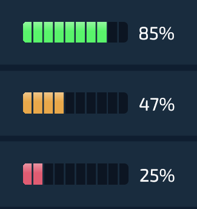

## Overview

A Segmented progress bar that is built on top of the [Progress Bar component](/components/feedback/progress-bar/).
It is split into discrete **pills** instead of one continuous fill. The notches between pills are drawn with a single `repeating-linear-gradient` overlay, so there are no extra DOM elements per segment. The fill color shifts between **error**, **warning**, and **success** states based on the value.

- **Pill segments** from one gradient overlay
- **Color states** (red / amber / green) driven by the value
- **Configurable** segment count, gap width, and colors

## How it works

The track has two layers:

1. The **fill** - a solid colored rectangle whose width is the progress value.
2. An **overlay** (`::after`) - a `repeating-linear-gradient` that paints the notches *on top* of the fill, carving the continuous fill into pills.

Because the notches sit on top, you never have to render individual segments - you just size the fill so its edge lands inside a notch, and the overlay does the rest.

:::note[Full pill rounding]
The value rounds **down** to whole pills, so a value of `65` lights 6 pills, and the 7th waits until `70`.
:::

## How to download

## Usage

Drop it anywhere and pass a `value` from `0` to `100`:

```tsx
<SegmentedProgressBar value={health()} />
```

Or wrap it in a [Flex](/components/layout/flex) to add a label:

```tsx
<Flex style={{width: '20vmax', height: '5vmax', padding: '1rem'}} direction="row" gap="1rem" align-items="center">
    <SegmentedProgressBar value={health()} />
    <div>{`${health()}%`}</div>
</Flex>
```

## Customizing

Most of the look is driven by a handful of variables.

### Change the number of pills

Update **both** sides - the SCSS `$segments` and the TS `SEGMENTS` constant must match:

```scss
$segments: 12; // was 10
```
```tsx
const SEGMENTS = 12;
```

### Change the gap (notch) width

```scss
$gap: 2.5%; // wider notches
```
```tsx
const GAP = 2.5;
```

### Change the colors / thresholds

Swap the `$error` / `$warning` / `$success` SCSS variables for the look, and adjust the `value >=` checks in `progressFillClasses` for when each state kicks in.

:::tip
The `SEGMENTS`, `GAP`, and `OVERSHOOT` values are intentionally duplicated between the `.tsx` and `.scss` files - the fill math needs them in JS, the overlay needs them in CSS. Always change both, or the fill will stop lining up with the notches.
:::