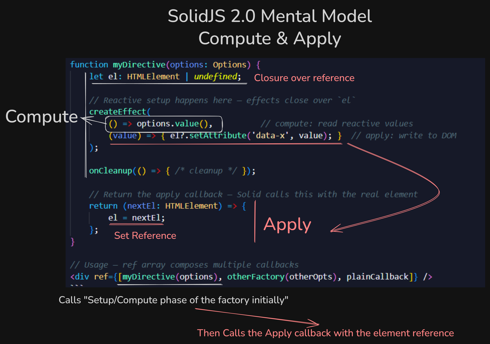

# Gameface UI — SolidJS 2.0 Migration Notes

> **Status:** Proof of concept. Solid 2.0 is still in beta with no confirmed release date.
> Do not merge to main until `solid-js` and `@solid-primitives` publish stable 2.0 releases.
> Use this document as an execution guide when the time comes.

---

## Key Terms

Before reading the rest of the doc, make sure these terms are clear. They come up everywhere.

**Tracking scope (reactive scope)**
A block of code where Solid watches which reactive values are read and sets up dependencies on them. When any of those values change, the scope re-runs. Examples: JSX expressions, `createMemo`'s function, `createEffect`'s compute function. Code outside these scopes is NOT tracked.

**Untracked read**
Reading a reactive value outside a tracking scope. Solid never sets up a dependency, so the read happens once and is stale forever. In Solid 2.0 dev mode, this triggers a `STRICT_READ_UNTRACKED` warning.

**Owner / Owned scope**
Every reactive primitive you create (signal, memo, effect) is attached to an "owner" — the reactive context that was active when it was created. When the owner is disposed (e.g. a component unmounts), Solid automatically disposes everything it owned. If you create a reactive primitive with no owner (e.g. outside a component or `createRoot`), it leaks forever because nothing will ever clean it up. "Owned scope" means: code running under an active owner.

**Signal-backed prop**
A prop whose value is a reactive getter on the underlying object. When the parent passes `<Comp value={signal()} />`, Solid compiles this to `{ get value() { return signal() } }` — a getter. Reading `props.value` inside a tracking scope sets up a dependency. When the parent passes `<Comp value="static" />`, the prop is a plain property — reading it is not reactive and never warns.

---

## Important Concept Changes

Read this to get a summarized overview of the changes that concern us the most.

### Components are now async-capable

In Solid 2.0, any memo or computation can return a `Promise`. When async data is not yet ready, the component **suspends** — Solid throws internally and shows a `<Loading>` fallback. When the data resolves, Solid **resumes** only the reactive expressions that were blocked (JSX, memos, effects). **The component body does not re-run.**

This is the root cause of the new strict rules. The component body is "setup" — it runs once. Reactive tracking happens inside JSX, memos, and effects — those are the things that re-run.

### The Three Phases

Solid 2.0 formalises a clear execution model. Every operation belongs to exactly one phase:

| Phase | Where | What is allowed |
|---|---|---|
| **Setup** | Component body | Create reactive primitives (`createSignal`, `createMemo`, `onCleanup`). No reactive reads. |
| **Compute (Track)** | `createEffect` compute fn, `createMemo`, JSX expressions | Read reactive values, return a snapshot. No side effects. |
| **Apply (Act)** | `createEffect` apply fn, `ref` callbacks, event handlers | Write to DOM, call APIs. No new reactive primitives. No reactive reads. |

This same pattern repeats everywhere in the new API:

- `createEffect(compute, apply)` — compute reads, apply acts
- `ref={[factory(props), callback]}` — factory sets up (creates effects), callback applies to DOM element
- JSX template — is a tracking scope, reactive reads here ARE tracked and will update

### Strict Top-Level Reads (`STRICT_READ_UNTRACKED`)

**In dev mode, reading a reactive value directly in the component body throws a warning.**

```tsx
// BAD — props.title is a reactive getter, reading it in setup is untracked
function Title(props) {
    const t = props.title;
    return <h1>{t}</h1>;  // t is stale, will never update
}

// GOOD — read happens inside JSX (a tracking scope)
function Title(props) {
    return <h1>{props.title}</h1>;
}

// GOOD — intentional one-time read with untrack
function Title(props) {
    const t = untrack(() => props.title);
    return <h1>{t}</h1>;
}
```

**Important nuance:** the warning only fires when the prop is *signal-backed* — i.e., the parent passed it as a dynamic expression (`value={signal()}`). Static props (`value="constant"`) are plain object properties and do not warn. This means a missing `untrack` can silently hide until a user passes a signal. Use `untrack` defensively for any prop read in the setup phase.

This also applies to function children in control-flow components (`Show`, `For`, etc.). Their callback bodies are structure-building, not tracking scopes.

### No Writes Under Owned Scope

Signal setters called inside an effect or component body **throw in dev**. Writes belong in event handlers, `onSettled`, or `untrack` blocks. For signals that genuinely need to be written from within scope, opt in with `{ ownedWrite: true }`.

```tsx
// BAD — throws in dev
createEffect(() => {
    setCount(count() + 1);
});

// GOOD — write in event handler
button.onclick = () => setCount(c => c + 1);

// GOOD — opt-in for internal flags
const [flag, setFlag] = createSignal(false, { ownedWrite: true });
```

### Microtask Batching (batch removed)

Updates are applied on the next microtask by default. `batch()` is removed. Use `flush()` when you need to read the DOM synchronously right after a state change.

```tsx
// 1.x
batch(() => { setA(1); setB(2); });

// 2.0 — automatic, no wrapper needed
setA(1);
setB(2);
// Both flush together on the next microtask

// When you need immediate sync application:
flush(() => { setSubmitted(true); });
inputRef.focus();
```

---

## TypeScript & Build Config

### `tsconfig.json`

```diff
- "moduleResolution": "node",
+ "moduleResolution": "bundler",
```

The `"node"` strategy does not understand the `exports` field in `package.json`, which is how `@solidjs/web` exposes its subpaths (e.g. `@solidjs/web/jsx-runtime`). Switching to `"bundler"` fixes the TypeScript errors about missing modules.

```diff
- "baseUrl": "./"
```

`baseUrl` is no longer needed. Remove it. Without it, path aliases in `paths` must include `./` prefixes:

```json
"paths": {
    "@components/*": ["./src/components/*"],
    "@views/*": ["./src/views/*"]
}
```

---

## API Renames & Removals

| Old (1.x) | New (2.0) | Notes |
|---|---|---|
| `onMount` | `onSettled` | Runs after first render settles |
| `mergeProps` | `merge` | Same semantics |
| `splitProps` | `omit` | Returns a proxy view, not a copy — no allocation |
| `batch` | `flush()` | See batching section above |
| `createComputed` | `createEffect` (split form) | See effects section below |
| `Context.Provider` | Context used directly | `<MyContext value={...}>` |
| `on` helper | Removed | Not needed with split effects |

---

## Changed Imports

### JSX namespace

```diff
- import type { JSX } from "solid-js";
+ import type { JSX } from "@solidjs/web";
```

### Component prop types

```diff
- import type { ComponentProps } from "solid-js";
+ import type { ComponentProps } from "@solidjs/web";
```

### Module augmentation for IntrinsicElements

```diff
- declare module "solid-js" {
+ declare module "@solidjs/web" {
    namespace JSX {
        interface IntrinsicElements { ... }
    }
}
```

### `solid-js/web` is gone

`solid-js/web` no longer exists. Everything that was there (e.g. `isServer`, `render`) now lives in `@solidjs/web`. This also affects third-party packages — see the `@solid-primitives` patch section below.

---

## Directives Removed → Two-Phase Ref Pattern

`use:`, `attr:`, `bool:`, and `on:` namespaces are all removed in 2.0.

### Old directive pattern (1.x)

```tsx
// Directive was a function that Solid called with (el, accessor)
function myDirective(el: HTMLElement, accessor: Accessor<Options>) {
    const opts = accessor();
    createEffect(() => { /* reactive, el is available */ });
}

// Usage
<div use:myDirective={options} />
```

### New pattern (2.0) — factory + ref array

The directive is replaced by a **factory** that you call yourself with options, returning a callback that Solid calls with the DOM element.

```tsx
// Factory — you call it with options (setup phase, owned)
function myDirective(options: Options) {
    let el: HTMLElement | undefined;

    // Reactive setup happens here — effects close over `el`
    createEffect(
        () => options.value(),          // compute: read reactive values
        (value) => { el?.setAttribute('data-x', value); }  // apply: write to DOM
    );

    onCleanup(() => { /* cleanup */ });

    // Return the apply callback — Solid calls this with the real element
    return (nextEl: HTMLElement) => {
        el = nextEl;
    };
}

// Usage — ref array composes multiple callbacks
<div ref={[myDirective(options), otherFactory(otherOpts), plainCallback]} />
```



**Key insight:** `el` is declared in the factory scope. Effects close over it. The apply callback assigns it. This is the "closure bridge" between setup and apply timelines. The factory runs in an owned scope (effects will be cleaned up); the apply callback runs unowned (do not create effects inside it).

### `attr:` prefix

`attr:` was used to force attribute mode. In 2.0 it is removed — Solid defaults to attributes for unknown props. `data-*` attributes work natively without any prefix.

---

## Effects — Split Form

`createEffect` now accepts two functions instead of one.

```tsx
// 1.x — single callback, runs reactively
createEffect(() => {
    el.className = props.class;
});

// 2.0 — compute returns a value, apply receives it
createEffect(
    () => props.class,              // compute: read reactive values, return snapshot
    (value, prev) => {              // apply: write to DOM, runs after flush
        el.className = value;
        return () => { /* optional cleanup */ };
    }
);
```

The compute phase runs tracked (sets up dependencies). The apply phase runs **untracked** — reading reactive values there will trigger `STRICT_READ_UNTRACKED`. Extract everything you need in compute and pass plain values to apply.

---

## Component Props & Types

### `ComponentProps.d.ts`

- Replace `JSX` import source: `"solid-js"` → `"@solidjs/web"`
- Replace `attr:*` index signature with `data-*`:

```diff
- [key: `attr:${string}`]: any;
+ [key: `data-${string}`]: string | undefined;
```

- Move module augmentation target:

```diff
- declare module "solid-js" {
+ declare module "@solidjs/web" {
```

- Remove `DirectiveFunctions` interface — `use:` is gone.

**Do not extend `ComponentProps<"div">` from `@solidjs/web` as the base type.** Gameface does not support the full HTML attribute surface (no aria, limited events). Keep the curated own type. Components that need a specific element's attribute subset should extend only what they use explicitly.

---

## Directives in BaseComponent

`BaseComponent` used to expose `use:baseComponent` and `use:navigationActions` as directives. Both are now factories used via the ref array.

```tsx
// LayoutBase — 1.x
<div use:baseComponent={props} use:navigationActions={navConfig()}>

// LayoutBase — 2.0
<div ref={[baseComponent(props), navigationActions(navConfig())]}>
```

The logic remains the same. The only thing that needs to change is the way data is called and set and the order of opperations to accommodate the new `createEffect` pattern.

### Refs

**We can finally move the ref setter inside the base component!**

For components that need to expose internal state through a `ref` prop (e.g. Checkbox), populate `props.refObject` in the setup phase. 

`BaseComponent`'s apply callback (the return) handles calling `props.ref` with the object merged with the real element.

In short, the patern we did for every component in the `onMount` can now be achieved directly in the `baseComponent`.

So for the Checkbox it would look like this:

```diff
// Completely remove the onMount setup
-onMount(() => {
-    if (!props.ref || !element) return;
-
-    (props.ref as unknown as (ref: any) => void)({
-        checked,
-        value: props.value,
-        setChecked,
-        element,
-    });
-});
// Checkbox setup
+props.refObject = {
+    checked,
+    setChecked,
+    value: untrack(() => props.value),
+    // element is injected automatically by BaseComponent
+};

<div ref={[baseComponent(props)]}>
```

```tsx
// BaseComponent apply phase
return (nextEl: HTMLElement) => {
    el = nextEl;
    attachEvents(nextEl);
    if (!props.ref) return;
    if (props.refObject) {
        (props.ref as Function)({ ...props.refObject, element: nextEl });
    } else {
        (props.ref as Function)(nextEl);
    }
};
```

`refObject` is typed in `ComponentProps` so the contract is documented. Use `untrack` for any prop read inside the object literal — a prop passed as a signal by the consumer would otherwise trigger `STRICT_READ_UNTRACKED`.

#### Components that need the HTML element during setup

For components that actually use the html element, it can be assigned in an alternative ref callback like this:

```diff lang="tsx"
+let element: HTMLDivElement | undefined
// .......
return (
    <div 
        ref={[baseComponent(props), 
+        el => { element = el; }]} 
    >
)
```


#### Keeping TS happy

We would need to make slight modifications to the ref types:

```diff
-ref?: unknown | ((ref: BaseComponentRef & T) => void);
-refObject?: T;
+ref?: ((ref: BaseComponentRef & T) => void) | (BaseComponentRef & T);
+refObject?: Omit<T, keyof BaseComponentRef>;
```

(We don't need the stuff that is in `BaseComponentRef` because it will be automatically injected in the directive when the component mounts)

#### Wrappers that accept `ComponentProps` will throw TS errors

Once a component types its props as `ComponentProps<SomeRef>`, passing those props into any utility typed as plain `ComponentProps` (defaults to `ComponentProps<{}>`) causes a TypeScript error on the `ref` property. Fix by changing the parameter to `ComponentProps<any>` on any function that doesn't itself define the ref shape:

```diff
- function baseComponent(props: ComponentProps)
+ function baseComponent(props: ComponentProps<any>)

- const LayoutBase: ParentComponent<ComponentProps>
+ const LayoutBase: ParentComponent<ComponentProps<any>>

- function mergeNavigationActions(props: ComponentProps, ...)
+ function mergeNavigationActions(props: ComponentProps<any>, ...)
```

#### New Type For Layout Components

All components that extend `LayoutBase` can have a new type that omits the: `componentClasses`, `componentStyles` and `refObject` properties.

Currently they extend `ComponentBaseProps` which is incorrect for two reasons:

- **Components with a specific ref** (e.g. `Scroll`, `Grid`, `GridTile`) — `ComponentBaseProps` infers Solid's base `Ref<T>` type, so TypeScript won't catch it if a caller passes the wrong ref shape.
- **Components with no custom ref** — `ComponentBaseProps` accepts any type for `ref`, so TypeScript won't complain even if a completely wrong type is assigned. Switching to `LayoutComponentProps` (no type argument) constrains `ref` to `HTMLElement`, making incorrect assignments a type error.

```diff
-interface GridProps extends ComponentBaseProps {
+interface GridProps extends LayoutComponentProps<GridRef> {
```

#### Stuff we need to handle

The only mundane change we need to do is to manually:

- Remove the onMounts that set the ref
- Declare the refObject
- Type the component's props with generic of the expected ref (checkbox ex: `ComponentProps<CheckboxRef>`)
- Remove the `let! element: HTMLElement` declarations across the components that dont actually need the html element in their setup. For the ones that do, we need to pass a callback to the ref
(ex: `ref={[baseComponent(props), (el) => element = el ]}` )

---

## Tokens (`@solid-primitives/jsx-tokenizer`)

### Why tokens break

`@solid-primitives/jsx-tokenizer` v1.x imports from `solid-js/web`, which no longer exists in Solid 2.0. The dependency `@solid-primitives/utils` has the same issue, and additionally references `onMount` and `equalFn` which were removed.

### Patch

Patches are committed under `patches/` and auto-applied via the `postinstall` npm hook (using `patch-package`). The fixes are:

- `@solid-primitives/jsx-tokenizer`: `solid-js/web` → `@solidjs/web`
- `@solid-primitives/utils`: same import fix, `onMount` stubbed as `onSettled`, `equalFn` replaced with inline equality fn

The core token mechanism (components returning zero-arg functions as children) still works in Solid 2.0 beta. Tokens have been verified to function correctly after patching.

When `@solid-primitives` publishes official 2.0-compatible versions, delete the patch files and bump the versions in `package.json`.

### Token factory hooks (`useToken`, `useTokens`)

Reading `props.parentChildren` (or `props.children`) directly as an argument is a reactive read in the component body — this triggers `STRICT_READ_UNTRACKED`. The signature of `useToken` and `useTokens` must change to accept an accessor:

```diff
- useToken(Indicator, props.parentChildren)
+ useToken(Indicator, () => props.parentChildren)
```

Update the hook definition to accept `() => JSX.Element` and access it inside the `createMemo`.

---

## Context

```diff
// Provider syntax
- <MyContext.Provider value={...}>
+ <MyContext value={...}>

// Default-less context no longer returns T | undefined
- const ctx = useContext(MyCtx);
- if (!ctx) throw new Error("missing provider");
- return ctx;
+ return useContext(MyCtx);  // throws ContextNotFoundError automatically if no provider
```

---

## Navigation

### Directive (Setup)

Setup logic stays the same, it just needs to use the new `compute` -> `apply` pattern where DOM writes shouldn't happen in the compute body but in the return function of the ref instead

### UseNavigation hook

In solidJS 2.0 Context doesn't return `undefined` but instead throws an error. We need to change the hook to use try/catch (as per the docs recommendation) instead of checking for `undefiend` or `null`:

```ts
export const useNavigation = () => {
    try {
        return useContext(NavigationContext);
    } catch {
        return undefined;
    }
}
```

### Store updates

There has been a change on how store writes are updated. We need to change store writes like this:

```diff
-setConfig('actions', name, data);
+setConfig(s => {s.actions[name] = data});
```

### Verdict

Apart from the aforementioned changes there are also the same little changes like in the other components:
- createEffect structural change
- Method renames: onMount -> onSettled
- untracked reactive reads in the body of the component

---

## Tests

Most test files need only mechanical changes. Two files have non-trivial cases.

**All 31 test files** — `onMount` → `onSettled` (every usage is the same pattern: registering a document event listener)

**Import fixes:**
- `views/components-e2e/index.tsx` — `solid-js/web` → `@solidjs/web`
- `CarouselTest.tsx` — `solid-js/store` → `solid-js`

**CarouselTest.tsx** — All store setters use the removed path-style API. Straightforward ones become draft form (`setCarouselOptions(s => { s.itemWidth = 20 })`). The full-store reset is slightly different — use `Object.assign` inside the draft instead of replacing the whole object.

**BaseTest.tsx** — 5 uses of `attr:tabindex` / `attr:disabled` on plain HTML elements. Since `attr:` is removed and attribute mode is now the default, these become plain `tabindex={0}` / `disabled`.

---

## Migration Checklist

- [ ] `tsconfig.json` — `moduleResolution: "bundler"`, remove `baseUrl`, add `./` to path aliases
- [ ] `ComponentProps.d.ts` — JSX import, `data-*` index signature, module augmentation target, remove `DirectiveFunctions`
- [ ] `BaseComponent.tsx` — migrate `handleClasses`, `handleStyles`, `handleAttrs`, `handleEvents` to split effect form; `baseComponent` factory pattern; migrate `navigationActions`
- [ ] `LayoutBase.tsx` — replace `use:` directives with ref array
- [ ] All Layout components (`Flex`, `Grid`, `Absolute`, etc.) — verify prop passthrough, remove any `splitProps` usage
- [ ] All Basic components (`Dropdown`, `Checkbox`, `Select`, etc.) — replace `use:baseComponent` / `use:navigationActions` with ref array
- [ ] `tokenComponents.tsx` — update `useToken` / `useTokens` to accept `() => JSX.Element`
- [ ] All token call sites — wrap `props.children` / `props.parentChildren` in accessor
- [ ] Props mutations (`props.componentClasses = ...`) — replace with the `componentClasses` prop accepted by `LayoutBase` / proper memo pattern
- [ ] Any `onMount` → `onSettled`
- [ ] Any `batch(...)` → `flush(...)`
- [ ] Any `splitProps` → `omit`
- [ ] Any `mergeProps` → `merge`
- [ ] Remove `use:`, `attr:`, `bool:`, `on:` namespace usages
- [ ] Context provider syntax — `<MyContext.Provider value={...}>` → `<MyContext value={...}>`
- [ ] Store setters — path-style (`setStore("key", value)`) → draft-style (`setStore(s => { s.key = value })`)
- [ ] Component props — replace `extends ComponentBaseProps` with `extends LayoutComponentProps<Ref>` (or plain `LayoutComponentProps` for no custom ref) on all components that wrap `LayoutBase`
- [ ] Remove `onMount` ref callbacks — delete the `onMount` blocks that call `props.ref(...)` and replace with `props.refObject = { ... }` in the setup phase
- [ ] Fix signal writes in owned scope — any signal setter called directly in a component body (not in an event handler or effect) must be moved to `onSettled` or outside the component scope
- [ ] Views — apply all the above to view-level components (`Hud`, `Inventory`, `Menu`, etc.)
- [ ] `@solid-primitives` — verify official 2.0 packages released, remove patches

---

## Migrated So Far

Use this as a reference to avoid duplicating work. Everything listed here has had the full set of 2.0 changes applied.

**Do verify everything works correctly before merging**

### Infrastructure

- `tsconfig.json`
- `vite.config.mts`
- `package.json` (dependency versions, postinstall patch hook)
- `ComponentProps.d.ts`
- `BaseComponent.tsx`
- `LayoutBase.tsx`
- `tokenComponents.tsx`
- `mergeNavigationActions.ts`

### Basic Components

- **Button**
- **Checkbox** — Checkbox, CheckboxControl, CheckboxIndicator
- **Dropdown** — Dropdown, DropdownOption, DropdownOptions, DropdownTrigger
- **InlineTextBlock**
- **Input** — InputBase, InputWrapper, NumberInput, InputControlButton, PasswordInput, VisibilityButton, TextInput, useTextInput (shared hook)
- **Segment** — Segment, SegmentButton, SegmentButtons, SegmentIndicator
- **ToggleButton** — ToggleButton, ToggleButtonControl, ToggleButtonHandle, ToggleButtonIndicator

### Feedback Components

- **Progress** — ProgressBar, ProgressCircle

### Layout Components

- **Column**
- **Flex**
- **Grid** — Grid, GridContext
- **GridTile**
- **Scroll** — Scroll, ScrollBar, ScrollContent, ScrollHandle
- **TabLink**
- **Tabs**

### Media

- **Icon**

### Navigation (Utility)

- Navigation
- NavigationArea
- useActionMethods
- useAreaMethods, areaMethods.types.ts
- types.ts

### Views

The Inventory view seems to be working correctly, without any issues!
